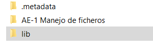

# AE-1 Manejo de Ficheros

## Configuración

Es importante que para que funcione el proyecto este bien configurado el entorno el único cambio que me gustaría destacar es que utilizamos una librería que se localiza en la misma carpeta que el proyecto.

<p align="center">
  
</p>

Dentro del eclipse nos vamos al proyecto y accedemos a la configuracion del build path

<p align="center">
  
</p>

1. Accedemos a la pestañas de librerias
2. Hacemos click en Classpath
3. Vamos al boton de Add External JARS

<p align="center">
  
</p>

1. Y añadimos la ubicacion de .jar

<p align="center">
  
</p>

---

# 🗃️Beans

## 📔Coche.java

Lo primero que tendremos será el Beans donde dentro de este se encontrará la clase con sus atributos, getter and setters.

```java
public class Coche implements Serializable{

  int id;
  String matricula, marca, modelo, color;
  private static final long serialVersionUID = 1L;
	
  public Coche() {
    
  }
	
  public Coche(int id,String matricula,String marca,String modelo,String color) {
    this.id = id;
    this.matricula = matricula;
    this.marca = marca;
    this.modelo = modelo;
    this.color = color;
  }
}
```

---

# 🗃️Dao

## 📔CocheDaoImpl.java

Aqui se encuentra los metodos que nos piden en la actividad
Ejemplo: añadir uno, Borrar….

```java
public class CocheDaoImpl implements IntCocheDao{

  private ArrayList<Coche> carList;
	
  public CocheDaoImpl() {
    carList = new ArrayList<Coche>();
  }
	
  /**
  * los coches se cargan del fichero
  */
  public void loadCar(Object readObject) {
    carList.add((Coche) readObject);
  }
	
  /**
  * Metodo para CREAR un coche nuevo
  * @return 1 en caso de que EXISTA
  *  <br> 
  * 		 0 en caso de que SE CREE
  */
  @Override
  public int newCar(Coche coche) {
    for (Coche c : carList) {
      if(c.getId() == coche.getId() || c.getMatricula().equals(coche.getMatricula()))
        return 1;
    }
    carList.add(coche);
    return 0;
  }

  /**
  * Metodo para BORRAR un coche
  * @param id <li>ID del coche que se borrara
  * @return True -> Se borro el coche
  *  <br> 
  * 		 False -> NO se borro el coche
  */
  @Override
  public Boolean deleteCar(int id) {
    for (Coche c : carList) {
      if(c.getId() == id) {
        carList.remove(c);
        return true;
      }
    }
    return false;
  }

  /**
  * Metodo para BUSCAR un coche
  * @param id <li>ID del coche que se quiere buscar
  * 
  * @return <li>Devuelve el objeto en caso de que exista
  * 			<li> Null en caso de que NO exista
  */
  @Override
  public Coche findById(int id) {
    for (Coche coche : carList) {
      if(id == coche.getId()) {
        return coche;
      }
    }
    return null;
  }

  /**
  * Metodo para LISTAR los coches
  * @return Devuelve la lista de coches
  */
  @Override
  public void listCar() {
    for (Coche c : carList) {
      System.out.println(c);
    }
    System.out.println("");
  }
	
  @Override
  public ArrayList<Coche> listOb() {
    return carList;
  }
	
}
```

---

# 🗃️Controller

## 📔MainCoche.java

En el Main tenemos la ejecución del programa lo que hace este main es crear un bucle en el que se solicita una opción del menu y dependiendo de que opción se seleccione nos llamara a su función correspondiente.

```java
public static void main(String[] args) {
  System.out.println("===========Iniciando Aplicacion============");
  ftloadFile();//llamamos a esta funcion para que nos cargue los coches del fichero .dat
  Boolean continua = true;
  while (continua == true) {
    System.out.println("1. Añadir nuevo coche\n" + "2. Borrar coche por id\n"
                      + "3. Consulta coche por id\n" + "4. Listado de coches\n"
                      + "5. Exportar coches a archivo CSV\n" + "6. Terminar el programa\n" );
    String opcion = nextLine();
    if(opcion.equals("1")) {//Añadir coche
      ftnewCar();
    }else if(opcion.equals("2")) {//Borrar coche
      ftdeleteCar();
    }else if(opcion.equals("3")) {//Buscar coche
      ftfindById();
    }else if(opcion.equals("4")) {//Listar coche
      cdao.listCar();
    }else if(opcion.equals("5")) {//Exportar a .csv
      ftexportToCsv();
    }else if(opcion.equals("6")) {//terminamos la ejecucion del programa y exportamos datos a .dat
      ftexit();
      continua = false;
    }
  }
}
```

### 📡ftloadFile

Este metodo nos permite cargar los datos del fichero.dat en nuestro arrayList en caso de que exista el archivo.

```java
/**
 * Metodo que utilizaremos para cargar 
 * los coches que hay en el fichero .dat en caso de que exista
 */
public static void ftloadFile() {
  //Cargar datos en array
  File fichero = new File("agenda.dat");
  if(fichero.exists()){//si existe el fichero agenda.dat
    System.out.println("Cargando fichero...");
    try(FileInputStream file = new FileInputStream("agenda.dat");
        ObjectInputStream buffer = new ObjectInputStream(file);){
			
      boolean eof = false;
      Coche c;
      while(!eof) {//no saldremos de este bucle hasta que nos avisen de que estamos al final del archivo
        try {
          c = (Coche) buffer.readObject();//vamos leyendo los Objetos
          cdao.newCar(c);//vamos añadiendo los coches a nuestro arrayList
        }catch (EOFException e) {//si salta la excepcion termino el fichero
          System.out.println("Se cargaron los datos con exito");
          eof = true;
        }catch(IOException e2){
          System.out.println("Error al leer los contactos de la agenda");
          System.out.println(e2.getMessage());
        }catch(ClassNotFoundException e3){
          System.out.println("La clase de contacto no se cargo en memoria");
          System.out.println(e3.getMessage());
        }
      }
    }catch (IOException e) {
      System.out.println("No se ha podido abrir la agenda de contactos");
      System.out.println(e.getMessage());
      return;
    }
  }
}
```

### 📡ftnewCar

En esta función es donde solicitaremos los datos por terminal para así poder **crear** un nuevo coche haciendo llamamiento al **método newCar** que se encuentra en el dao

```java
/**
 * Metodo para añadir los coches
 */
public static void ftnewCar() {
  Coche cAux = new Coche();
	
  System.out.println("======ID======");
  cAux.setId(Integer.parseInt(nextLine()));
  System.out.println("======Numero de matricula======");
  cAux.setMatricula(nextLine());
  System.out.println("======Marca======");
  cAux.setMarca(nextLine());
  System.out.println("======Modelo======");
  cAux.setModelo(nextLine());
  System.out.println("======Color======");
  cAux.setColor(nextLine());
	
  System.out.println();
  if (cdao.newCar(cAux) == 1) {//en caso de que no se cree
    System.out.println("No se pudo crear ya que hay un coche "
                    + "con el mismo id/matricula\n");
  }else
    System.out.println("Creado con exito " + cAux);
}
```

### 📡ftdeleteCar

En esta función es donde solicitaremos los datos por terminal para así poder **eliminar** un coche de la lista haciendo llamamiento al **método deleteCar** que se encuentra en el dao

```java
/**
 * Metodo que nos permitira borrar
 * un coche de la lista el cual tenga 
 * el mismo id que le pasamos
 */
public static void ftdeleteCar() {
  System.out.println("======Inserte el ID======");
  if(cdao.deleteCar(Integer.parseInt(nextLine())) == true) {
    System.out.println("Se borro exitosamente\n");
  }else
    System.out.println("No se pudo borrar el coche\n");
}
```

### 📡ftfindById

Utilizando esta función podremos buscar mediante un id un coche que exista en la lista esto se consigue llamando al método findById del dao

```java
/**
 * Metodo que nos permitira buscar 
 * un coche en la lista mediante un id
 */
public static void ftfindById() {
  System.out.println("======Inserta el ID======");
  System.out.println(cdao.findById(Integer.parseInt(nextLine())));
}
```

### 📡ftexit

Este método nos crea un archivo .dat en el que escribirá todo el contenido de nuestro ArrayList (en caso de que este tenga algo dentro)

Cuando se termine de ejecutar este método se cerrara la ejecución del programa ya que en el main salimos del bucle.

```java
/**
* Metodo que utilizaremos para crear un archivo .dat
* el cual contendra los elementos del arrayList
*/
public static void ftexit() {
  System.out.println("Vuelva pronto");
  if(!(cdao.listOb() == null || cdao.listOb().size() == 0)) {//en caso de que el  arrayList tenga contenido
    try(FileOutputStream file = new FileOutputStream(NOMBRE_FICHERO);//asi estariamos sobreescribiendo el contenido del archivo (por si existe)
        ObjectOutputStream buffer = new ObjectOutputStream(file)){

        for (Coche c : cdao.listOb()) {
          buffer.writeObject(c);
        }
    }catch (IOException e){
      System.out.println("No se pudo abrir el fichero");
      System.out.println(e.getMessage());
      return;
    }
  }
}
```

### 📡ftexportToCsv

Utilizando este método podremos exportar los datos del ArrayList (en caso de tener) a un archivo .csv esto se puede hacer gracias a la librería que se mostro al principio del fotosReadme

```java
/**
 * Metodo que nos permitira exportar 
 * los datos a un .csv (en caso de que tengamos datos)
 */
public static void ftexportToCsv() {
  String nombreArchivo = "agenda.csv";
  Boolean file = new File(nombreArchivo).exists();
			
  if(file){//si existe lo borramos
    File fl = new File(nombreArchivo);
      fl.delete();
  }
	
  if(!(cdao.listOb() == null || cdao.listOb().size() == 0)) {//en caso de que el arrayList tenga contenido
    //creamos el archivo
    try {
      CsvWriter csvFile = new CsvWriter(new FileWriter(nombreArchivo, true), ';');
      //nombre de las columnas
      csvFile.write("ID");
      csvFile.write("MATRICULA");
      csvFile.write("MARCA");
      csvFile.write("MODELO");
      csvFile.write("COLOR");
      csvFile.endRecord();//deja de escribir (lo cual pasaria a la siguiente linea)
			
      //recorremos las lista de coches
      for (Coche c : cdao.listOb()) {
      //vamos escribiendo cada atributo del coche en las celdas
        csvFile.write(Integer.toString(c.getId()));
        csvFile.write(c.getMatricula());
        csvFile.write(c.getMarca());
        csvFile.write(c.getModelo());
        csvFile.write(c.getColor());
        csvFile.endRecord();//deja de escribir (lo cual pasaria a la siguiente linea)
      }
      csvFile.close();//cerramos el archivo
      System.out.println("Archivo exportado con exito");
    }catch (IOException e) {
      System.out.println("Ocurrio un problema en la exportacion");
      e.printStackTrace();
    }
  }else {
    System.out.println("No hay datos para exportar \n");
  }
}
```