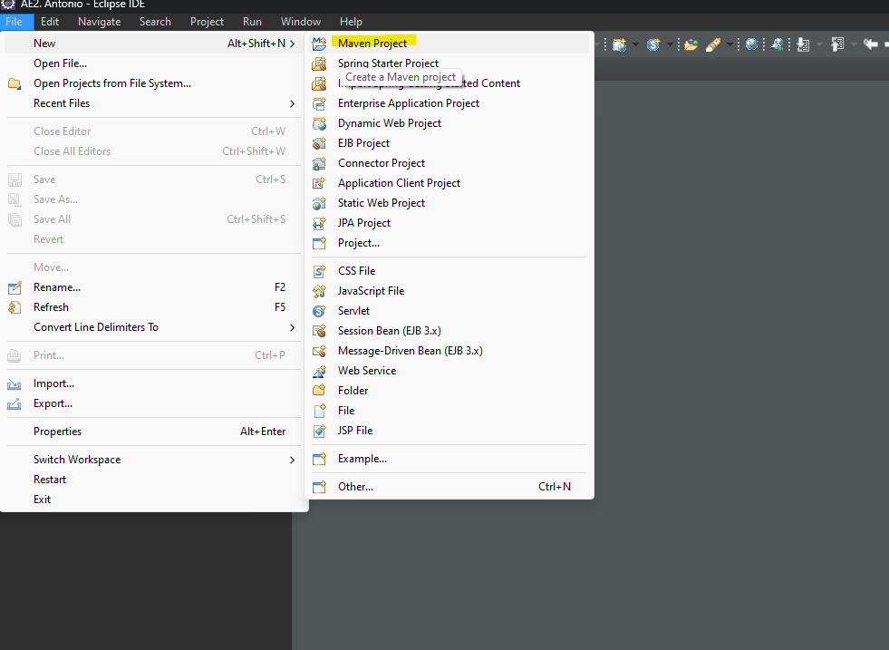

# A2- Manejo de conectores de BBDD

Para la realización de esta actividad utilizaremos la opción de creación (proyecto maven)

<p align="center">
  
</p>

En relación al guardado de datos, esta vez utilizaremos una base de datos relacional llamada MySQL que accederemos a ella a través de un gestor de servidores y base de datos como es el XAMPP.

<p align="center">
  
</p>

Una vez preparado el entorno, creamos el proyecto. Tras crear el proyecto deberemos ir al archivo pom.xml donde se encuentran las dependencias y propiedades necesarias para que funcione la base de datos y el servidor. Una vez introducidas las dependencias de la base de datos y las propiedades utilizaremos el botón derecho en nuestro programa y actualizaremos el proyecto.

**pom.xml**

```xml
<dependencies>
    <dependency>
      <groupId>mysql</groupId>
      <artifactId>mysql-connector-java</artifactId>
      <version>8.0.32</version>
    </dependency>
</dependencies>  
		

<properties>
    <maven.compiler.target>1.8</maven.compiler.target>
    <maven.compiler.source>1.8</maven.compiler.source>
</properties>
```

Para la estructura del proyecto utilizaremos un modelo de patrón DAO con una carpeta “controller” donde irá la lógica de los menús e inserción de datos por parte del cliente. Carpeta “entidad” donde se encontrarán las clases, la carpeta “dao” donde encontraremos los interface y por último una carpeta “persistencia” donde encontraremos las clases que implementan a las interface y añaden la lógica a los métodos.

 
<p align="center">
  
</p>

# 🗃️es.edix.modelo.entidad


## 📔Coche.java

En esta clase se encontrará los atributos, getter and setters ,equals/hashCode y el toString.

```java
public class Coche {
	
  int id;
  String matricula;
  String marca;
  String modelo;
  String color;
	
  public Coche() {
    	
  }

  public Coche(int id, String matricula, String marca, String modelo, String color) {
    super();
    this.id = id;
    this.matricula = matricula;
    this.marca = marca;
    this.modelo = modelo;
    this.color = color;
  }
}
```

## 📔Pasajero.java

En esta clase se encontrará los atributos, getter and setters ,equals/hashCode y el toString.

```java
public class Pasajero {
	
  int id;
  String nombre;
  int edad;
  double peso;
  int idCoche;
	
  public Pasajero() {
    super();		
  }
	
  public Pasajero(int id, String nombre, int edad, double peso, int idCoche) {
    super();
    this.id = id;
    this.nombre = nombre;
    this.edad = edad;
    this.peso = peso;
    this.idCoche = idCoche;
  }
}
```

# 🗃️es.edix.modelo.dao.interface

Aquí se localizan los archivos que obligan al dao a utilizar unos métodos en concreto como mínimo.

## 📔IntCocheDao.java

```java
public interface IntCocheDao {
	
  public boolean abrirConexion();
  public boolean cerrarConexion();
  public int newCar(Coche coche);
  public void modifyCar(Coche coche);
  public void deleteCar(int id);
  public Coche findById(int id);
  public void listOb();
}
```

## 📔IntPasajeroDao.java

```java
public interface IntPasajeroDao {
	
  public void deletePassenger(int id);
  public Pasajero findById(int id);
  public void passengerList();
  public void addPassenger (Pasajero pasajero);
  public void deleteCarPassenger(int id);
  public void passengerCarList(int id);
}
```

# 🗃️es.edix.modelo.persistencia

## 📔SqlDaoImpl.java

Lo primero que tenemos que hacer es implementar la interfaz del coche para asi poder usar los métodos que necesitamos.

```java
public class SqlDaoImpl implements IntCocheDao
```

Además de los métodos que nos añade el interface añadimos 2 mas que permita abrir y cerrar las comunicaciones con la BBDD.

### 📡 abrirConexion

Este método nos permitirá **ABRIR** la conexión con la base de datos

```java
public Boolean abrirConexion() {
  String url = "jdbc:mysql://localhost:3306/bbdd";
  String user = "root";
  String pass = "";
	
  try {
    conex = DriverManager.getConnection(url, user, pass);
  } catch (SQLException e) {
    e.printStackTrace();
    return false;
  }
  return true;
}
```

### 📡 cerrarConexion

Este método nos permitirá **CERRAR** la conexión con la base de datos

```java
public Boolean cerrarConexion() {
  try {
    conex.close();
  } catch (SQLException e) {
    e.printStackTrace();
    return false;
  }
  return true;
}
```

---

> **IMPORTANTE: Los nombres de los campos tienen que estar escritos tal cual como están en la base de datos para que el query funcione correctamente.**
> 

### 📡 newCar

Con este método podremos **CREAR** nuevos registros en la base de datos

1. Hacemos una comprobación de que se puede realizar la conexión con la base de datos
    - En caso de que no se pueda realizar nos devolverá un mensaje avisando de esto (esto se hace para que no se rompa el programa)
2. Creamos la sentencia SQL que queremos realizar
    - Las ? son los sitios en los que ingresaremos los datos.
3. Accedemos a la sentencia SQL para poder sustituir los datos
    - `ps.setString(1, coche.getMatricula());` el hace referencia a que ? será en la que se ingrese el dato.
4. Ejecutamos la query
5. Cerramos la conexión
6. Decimos que ocurrió al ejecutar la operación 
    - Si devuelve **1** significa que **SI** se realizo la operación
    - Si devuelve **0** significa que **NO** se realizo la operación

```java
public int newCar(Coche coche) {
  if(!abrirConexion()) {//1
    System.out.println("Error al conectar cn la bd");	//1
  }
  String query = "insert into coche (MATRICULA, MARCA,MODELO,COLOR) values (?,?,?,?)";//2
	
  try {
    PreparedStatement ps = conexion.prepareStatement(query);//3
    ps.setString(1, coche.getMatricula());//3
    ps.setString(2, coche.getMarca());//3
    ps.setString(3, coche.getModelo());//3
    ps.setString(4, coche.getColor());//3
		
    ps.executeUpdate();//4
		
  }catch (SQLException e) {
    e.printStackTrace();
    System.out.println("Error al crear el coche" );
    return 0;//6
  }finally {
    cerrarConexion();//5
  }
  return 1;//6
	
}
```

### 📡 deleteCar

Con este método podremos **BORRAR** registros en la base de datos

1. Hacemos una comprobación de que se puede realizar la conexión con la base de datos
    - En caso de que no se pueda realizar nos devolverá un mensaje avisando de esto (esto se hace para que no se rompa el programa)
2. Creamos la sentencia SQL que queremos realizar
    - Las ? son los sitios en los que ingresaremos los datos.
3. Accedemos a la sentencia SQL para poder sustituir los datos
    - `ps.setInt(1, id);` el hace referencia a que ? será en la que se ingrese el dato.
4. Ejecutamos la query
5. Cerramos la conexión
6. Avisamos de que se borro el coche

```java
public void deleteCar(int id) {
  if(!abrirConexion()) {//1
    System.out.println("Error al conectar cn la bd");//1
  }
  String query = "delete from coche where ID = ?";//2
  try {
    PreparedStatement ps = conexion.prepareStatement(query);//3
    ps.setInt(1,id);//3
		
    ps.executeUpdate();//4
  } catch (SQLException e) {
    System.out.println("Error al eliminar el coche con id: "+ id );
    e.printStackTrace();
  }finally {
    cerrarConexion();//5
  }
  System.out.println("Coche borrado exitosamente \n");
}
```

### 📡 findById

Con este método podremos **BUSCAR** registros en la base de datos

1. Hacemos una comprobación de que se puede realizar la conexión con la base de datos
    - En caso de que no se pueda realizar nos devolverá un mensaje avisando de esto (esto se hace para que no se rompa el programa)
2. Creamos la sentencia SQL que queremos realizar
    - Las ? son los sitios en los que ingresaremos los datos.
3. Accedemos a la sentencia SQL para poder sustituir los datos
    - `ps.setInt(1, id);` el hace referencia a que ? será en la que se ingrese el dato.
4. Ejecutamos la query
5. Vamos guardando los registros que recibimos de la BBDD en un objeto coche.
    - En este caso el 1 hace referencia a primer elemento de la consulta SQL
    `persona.setId(rs.getInt(1));`
6. Cerramos la conexión
7. Devolvemos el coche

```java
public Coche findById(int id) {
  if(!abrirConexion()) {//1
    System.out.println("Error al conectar cn la bd");//1
  }
  String query = "select ID, MATRICULA, MARCA, MODELO, COLOR from coche where ID=?";//2
  Coche coche= null;

  try {
    PreparedStatement ps = conexion.prepareStatement(query);//3
    ps.setInt(1, id);//3
		
    ResultSet rs = ps.executeQuery();//4
    while(rs.next()) {//5
      coche = new Coche();//5
      coche.setId(rs.getInt(1));//5
      coche.setMatricula(rs.getString(2));//5
      coche.setMarca(rs.getString(3));//5
      coche.setModelo(rs.getString(4));//5
      coche.setColor(rs.getString(5));//5
    }
  }catch (SQLException e) {
    System.out.println("Error al buscar el coche con id: "+ id );
    e.printStackTrace();
  }finally {
    cerrarConexion();//6
  }
  return coche;//7
}
```

### 📡 listarOb

Con este método podremos **LISTAR** registros de la base de datos

1. Hacemos una comprobación de que se puede realizar la conexión con la base de datos
    - En caso de que no se pueda realizar nos devolverá un mensaje avisando de esto (esto se hace para que no se rompa el programa)
2. Creamos la sentencia SQL que queremos realizar
    - Las ? son los sitios en los que ingresaremos los datos.
3. Ejecutamos la query
4. Vamos guardando los registros que recibimos de la bbdd en un objeto coche.
    - En este caso el 1 hace referencia a primer elemento de la consulta SQL
    `persona.setId(rs.getInt(1));`
5. Cuando tengamos el coche completo lo pintamos
6. Cerramos la conexión

```java
public void listOb() {
  if(!abrirConexion()) {//1
    System.out.println("Error al conectar cn la bd");//1
  }
	
  String query= "select ID, MATRICULA, MARCA, MODELO, COLOR from coche";//2
  try {
    PreparedStatement ps = conexion.prepareStatement(query);//3
    ResultSet rs = ps.executeQuery();//3

    while(rs.next()) {//4
      Coche coche = new Coche();//4
      coche.setId(rs.getInt(1));//4
      coche.setMatricula(rs.getString(2));//4
      coche.setMarca(rs.getString(3));//4
      coche.setModelo(rs.getString(4));//4
      coche.setColor(rs.getString(5));//4
			
      System.out.println(coche);//5
    }	
    System.out.println();
		
  }catch (SQLException e) {
    System.out.println("Error al listar los coches");
    e.printStackTrace();
  }finally {
    cerrarConexion();//6
  }
}
```

### 📡 modificar

Con este método podremos **MODIFICAR** registros de la base de datos

1. Hacemos una comprobación de que se puede realizar la conexión con la base de datos
    - En caso de que no se pueda realizar nos devolverá un null (esto se hace para que no se rompa el programa)
2. Creamos la sentencia SQL que queremos realizar
    - Las ? son los sitios en los que ingresaremos los datos.
3. Accedemos a la sentencia SQL para poder sustituir los datos
    - `ps.setString(1, coche.getMatricula());`  el hace referencia a que ? será en la que se ingrese el dato.
4. Ejecutamos la query
    - Si devuelve **1** significa que **SI** se realizo la operación
        - Mandamos un mensaje avisando de esto
    - Si devuelve **0** significa que **NO** se realizo la operación
        - Mandamos un mensaje avisando de esto
5. Cerramos la conexión

```java
public void modifyCar(Coche coche) {
  if(!abrirConexion()) {//1
    System.out.println("Error al conectar cn la bd");//1
  }
  String query = "update coche set MATRICULA=?, MARCA=?,MODELO=?,COLOR=? where ID=?";//2
  try {
    PreparedStatement ps = conexion.prepareStatement(query);//3
    ps.setString(1, coche.getMatricula());//3
    ps.setString(2, coche.getMarca());//3
    ps.setString(3, coche.getModelo());//3
    ps.setString(4, coche.getColor());//3
    ps.setObject(5, coche.getId());//3
		
    int afectados = ps.executeUpdate();//4
    if(afectados==0) {//4
      System.out.println("No se modifico el coche \n");//4
    }else {//4
      System.out.println("Coche modificado \n");//4
    }
		
  }catch (SQLException e) {
    System.out.println("Error al modificar el coche con id: "+ coche.getId() );
    e.printStackTrace();
  }finally {
    cerrarConexion();//5
  }
	
}
```

## 📔SqlDaoPasajeroImpl.Java

Lo primero que tenemos que hacer es implementar la interfaz del coche para asi poder usar los métodos que necesitamos.

```java
public class SqlDaoImpl implements IntCocheDao
```

Además de los métodos que nos añade el interface añadimos 2 mas que permita abrir y cerrar las comunicaciones con la BBDD.

### 📡 abrirConexion

Este método nos permitirá **ABRIR** la conexión con la base de datos

```java
public Boolean abrirConexion() {
  String url = "jdbc:mysql://localhost:3306/bbdd";
  String user = "root";
  String pass = "";
	
  try {
    conex = DriverManager.getConnection(url, user, pass);
  } catch (SQLException e) {
    e.printStackTrace();
    return false;
  }
  return true;
}
```

### 📡 cerrarConexion

Este método nos permitirá **CERRAR** la conexión con la base de datos

```java
public Boolean cerrarConexion() {
  try {
    conex.close();
  } catch (SQLException e) {
    e.printStackTrace();
    return false;
  }
  return true;
}
```

---

### 📡 findById

Con este método podremos **BUSCAR** registros en la base de datos

1. Hacemos una comprobación de que se puede realizar la conexión con la base de datos
    - En caso de que no se pueda realizar nos devolverá un mensaje avisando de esto (esto se hace para que no se rompa el programa)
2. Creamos la sentencia SQL que queremos realizar
    - Las ? son los sitios en los que ingresaremos los datos.
3. Accedemos a la sentencia SQL para poder sustituir los datos
    - `ps.setInt(1, id);` el hace referencia a que ? será en la que se ingrese el dato.
4. Ejecutamos la query
5. Vamos guardando los registros que recibimos de la BBDD en un objeto pasajero.
    - En este caso el 1 hace referencia a primer elemento de la consulta SQL
    `persona.setId(rs.getInt(1));`
6. Cerramos la conexión
7. Devolvemos el pasajero

```java
public Pasajero findById(int id) {
  if(!abrirConexion()) {//1
    System.out.println("Error al conectar cn la bd");//1
  }
  String query = "select ID_PASAJERO, NOMBRE, EDAD, PESO, ID_COCHE from pasajero where ID_PASAJERO=?";//2
  Pasajero pa= null;
  try {
    PreparedStatement ps = conexion.prepareStatement(query);//3
    ps.setInt(1, id);//3
		
    ResultSet rs = ps.executeQuery();//4
    while(rs.next()) {//5
      pa = new Pasajero();//5
      pa.setId(rs.getInt(1));//5
      pa.setNombre(rs.getString(2));//5
      pa.setEdad(rs.getInt(3));//5
      pa.setPeso(rs.getDouble(4));//5
      pa.setIdCoche(rs.getInt(5));//5
    }
  }catch (SQLException e) {
    System.out.println("Error al buscar el pasajero con id: "+ id );
    e.printStackTrace();
  }finally {
    cerrarConexion();//6
  }
  return pa;
}
```

### 📡 addPassenger

Con este método podremos **CREAR** nuevos registros en la base de datos

1. Hacemos una comprobación de que se puede realizar la conexión con la base de datos
    - En caso de que no se pueda realizar nos devolverá un mensaje avisando de esto (esto se hace para que no se rompa el programa)
2. Creamos la sentencia SQL que queremos realizar
    - Las ? son los sitios en los que ingresaremos los datos.
3. Accedemos a la sentencia SQL para poder sustituir los datos
    - `ps.setString(1, pasajero.getNombre());` el hace referencia a que ? será en la que se ingrese el dato.
4. Ejecutamos la query
5. Mandamos un mensaje diciendo que se añadió el pasajero
6. Cerramos la conexión

```java
public void addPassenger(Pasajero pasajero) {
  if(!abrirConexion()) {//1
    System.out.println("Error al conectar cn la bd");//1
  }
  String query = "insert into pasajero (NOMBRE, EDAD, PESO, ID_COCHE) values (?,?,?,?)";//2
	
  try {
    PreparedStatement ps = conexion.prepareStatement(query);//3
    ps.setString(1, pasajero.getNombre());//3
    ps.setInt(2, pasajero.getEdad());//3
    ps.setDouble(3, pasajero.getPeso());//3
    ps.setInt(4, 0);//3
		
    ps.executeUpdate();//4
    System.out.println("Pasajero añadido \n");//5
  }catch (SQLException e) {
    e.printStackTrace();
    System.out.println("Error al crear el pasajero" );
  }finally {
    cerrarConexion();//6
  }		
}
```

### 📡 deletePassenger

Con este método podremos **BORRAR** registros en la base de datos

1. Hacemos una comprobación de que se puede realizar la conexión con la base de datos
    - En caso de que no se pueda realizar nos devolverá un mensaje avisando de esto (esto se hace para que no se rompa el programa)
2. Creamos la sentencia SQL que queremos realizar
    - Las ? son los sitios en los que ingresaremos los datos.
3. Accedemos a la sentencia SQL para poder sustituir los datos
    - `ps.setInt(1, id);` el hace referencia a que ? será en la que se ingrese el dato.
4. Ejecutamos la query
5. Cerramos la conexión
6. Avisamos de que el pasajero fue borrado

```java
public void deletePassenger(int id) {
  if(!abrirConexion()) {//1
    System.out.println("Error al conectar cn la bd");//1
  }
  String query = "delete from pasajero where ID_PASAJERO = ?";//2
  try {
    PreparedStatement ps = conexion.prepareStatement(query);//3
    ps.setInt(1,id);//3
		
    ps.executeUpdate();//4
  } catch (SQLException e) {
    System.out.println("Error al eliminar el pasajero con id: "+ id );
    e.printStackTrace();
  }finally {
    cerrarConexion();//5
  }
  System.out.println("Pasajero borado \n");//6
}
```

### 📡 passengerList

Con este método podremos **LISTAR** todos lo pasajeros de la base de datos

1. Hacemos una comprobación de que se puede realizar la conexión con la base de datos
    - En caso de que no se pueda realizar nos devolverá un mensaje avisando de esto (esto se hace para que no se rompa el programa)
2. Creamos la sentencia SQL que queremos realizar
    - Las ? son los sitios en los que ingresaremos los datos.
3. Ejecutamos la query
4. Vamos guardando los registros que recibimos de la bbdd en un objeto Pasajero.
    - En este caso el 1 hace referencia a primer elemento de la consulta SQL
    `persona.setId(rs.getInt(1));`
5. Cuando tengamos el coche completo lo pintamos
6. Cerramos la conexión

```java
public void passengerList() {
  if(!abrirConexion()) {//1
    System.out.println("Error al establecer conexion");//1
  }
	
  String query= "select ID_PASAJERO, NOMBRE, EDAD, PESO, ID_COCHE from pasajero";//2
  try {
    PreparedStatement ps = conexion.prepareStatement(query);//3
    ResultSet rs = ps.executeQuery();//3

    while(rs.next()) {//4
      Pasajero pasajero = new Pasajero();//4
      pasajero.setId(rs.getInt(1));//4
      pasajero.setNombre(rs.getString(2));//4
      pasajero.setEdad(rs.getInt(3));//4
      pasajero.setPeso(rs.getDouble(4));//4
      pasajero.setIdCoche(rs.getInt(5));//4
			
      System.out.println(pasajero);//5
    }
    System.out.println();
  }catch (SQLException e) {
    System.out.println("Error al listar los pasajeros");
    e.printStackTrace();
  }finally {
    cerrarConexion();//6
  }
}
```

### 📡 setCar

Con este método podremos **METER A UN PASAJERO EN UN COCHE**

1. Hacemos una comprobación de que se puede realizar la conexión con la base de datos
    - En caso de que no se pueda realizar nos devolverá un mensaje avisando de esto (esto se hace para que no se rompa el programa)
2. Creamos la sentencia SQL que queremos realizar
    - Las ? son los sitios en los que ingresaremos los datos.
3. Accedemos a la sentencia SQL para poder sustituir los datos
    - `ps.setInt(1, idCoche);`  el hace referencia a que ? será en la que se ingrese el dato.
4. Ejecutamos la query
    - Si devuelve **1** significa que **SI** se realizo la operación
        - Mandamos un mensaje avisando de esto
    - Si devuelve **0** significa que **NO** se realizo la operación
        - Mandamos un mensaje avisando de esto
5. Cerramos la conexión

```java
public void setCar(int idPasaj, int idCoche) {
  if(!abrirConexion()) {//1
    System.out.println("Error al conectar cn la bd");//1
  }
  String query = "update pasajero set ID_COCHE=? where ID_PASAJERO=?";//2
  try {
    PreparedStatement ps = conexion.prepareStatement(query);//3
    ps.setInt(1, idCoche);//3
    ps.setInt(2, idPasaj);//3
		
    int afectados = ps.executeUpdate();//4
    if(afectados==0) {//4
      System.out.println("inserte un id pasajero u id coche existente");//4
    }else {//4
      System.out.println("se añadio el pasajero al coche exitosamente");//4
    }
		
  }catch (SQLException e) {
    System.out.println("No se pudo añadir el pasajero al coche");
    e.printStackTrace();
  }finally {
    cerrarConexion();//5
  }
}
```

### 📡 deleteCarPassenger

Con este método estaremos **COLOCANDO UN 0 EN LA COLUMNA ID_COCHE DEL PASAJERO QUE NOS INDIQUEN**

1. Hacemos una comprobación de que se puede realizar la conexión con la base de datos
    - En caso de que no se pueda realizar nos devolverá un mensaje avisando de esto (esto se hace para que no se rompa el programa)
2. Creamos la sentencia SQL que queremos realizar
    - Las ? son los sitios en los que ingresaremos los datos.
3. Accedemos a la sentencia SQL para poder sustituir los datos
    - `ps.setInt(1, id);`  el hace referencia a que ? será en la que se ingrese el dato.
4. Ejecutamos la query
5. Devolvemos un mensaje avisando que se elimino el pasajero del coche
6. Cerramos conexión con la bd

```java
public void deleteCarPassenger(int id) {
  if(!abrirConexion()) {//1
    System.out.println("Error al conectar cn la bd");//1
  }
  String query = "update pasajero set ID_COCHE=0 where ID_PASAJERO=?";//2
  try {
    PreparedStatement ps = conexion.prepareStatement(query);//3
    ps.setInt(1, id);//3

    ps.executeUpdate();//4
    System.out.println("Se elimino el pasajero del coche");//5
  }catch (SQLException e) {
    System.out.println("No se pudo añadir el pasajero al coche");
    e.printStackTrace();
  }finally {
    cerrarConexion();//6
  }
}
```

### 📡 passengerCarList

Con este método **MOSTRAMOS LA LISTA DE PASAJERO QUES TIENE UN COCHE**

1. Hacemos una comprobación de que se puede realizar la conexión con la base de datos
    - En caso de que no se pueda realizar nos devolverá un mensaje avisando de esto (esto se hace para que no se rompa el programa)
2. Creamos la sentencia SQL que queremos realizar
    - Las ? son los sitios en los que ingresaremos los datos.
3. Accedemos a la sentencia SQL para poder sustituir los datos
    - `ps.setInt(1, id);`  el hace referencia a que ? será en la que se ingrese el dato.
4. Ejecutamos la query
5. Vamos guardando los registros que recibimos de la bbdd en un objeto Pasajero.
    - En este caso el 1 hace referencia a primer elemento de la consulta SQL
    `persona.setId(rs.getInt(1));`
6. Cuando tengamos el coche completo lo pintamos
7. Cerramos la conexión con la BBDD

```java
public void passengerCarList(int id) {
  if(!abrirConexion()) {//1
    System.out.println("Error al conectar cn la bd");//1
  }

  String query = "SELECT ID_PASAJERO, NOMBRE, EDAD, PESO, ID_COCHE FROM pasajero WHERE ID_COCHE=?";//2
  try {
    PreparedStatement ps = conexion.prepareStatement(query);//3
    ps.setInt(1, id);//3
    ResultSet rs = ps.executeQuery();//4

    while(rs.next()){//5
      Pasajero pasajero = new Pasajero();//5
      pasajero.setId(rs.getInt(1));//5
      pasajero.setNombre(rs.getString(2));//5
      pasajero.setEdad(rs.getInt(3));//5
      pasajero.setPeso(rs.getDouble(4));//5
      pasajero.setIdCoche(rs.getInt(5));//5
			
      System.out.println(pasajero);//6
    }
  }catch (SQLException e) {
    System.out.println("Error al buscar pasajeros en el coche");
    System.out.println(e.getMessage());
  }
  finally {
    cerrarConexion();//7
  }
}
```

# 🗃️es.edix.controller

## 📔Controller.java

Este seria el menú que se ve al arrancar el programa

```bash
===========Iniciando Aplicacion ============
1. Añadir nuevo coche
2. Borrar coche por id
3. Consulta coche por id
4. Listado de coches
5. Modificar coche por id
6. Añadir pasajeros al coche
7. Terminar el programa
```

Internamente es un bucle que se va a ejecutar siempre que no accedamos a la opción de cerrar el programa

Cada una de estas opciones hace el llamamiento a una función.

```java
public static void main(String[] args) {
    System.out.println("===========Iniciando Aplicacion============");
    Boolean continua = true;
		
    while (continua == true) {
      System.out.println("1. Añadir nuevo coche\n" + "2. Borrar coche por id\n"
          + "3. Consulta coche por id\n" + "4. Listado de coches\n"
          + "5. Modificar coche por id\n" + "6. Añadir pasajeros al coche\n"
          + "7. Terminar el programa\n" );
			
      String opcion = nextLine();
      if(opcion.equals("1")) {//Añadir coche
        ftAddCar();
				
      }else if(opcion.equals("2")) {//Borrar coche por id
        ftDeleteCarById();
				
      }else if(opcion.equals("3")) {//Buscar coche
        ftFindCarById();
				
      }else if(opcion.equals("4")) {//listar coches
        ftListCar();		       
		        
      }else if(opcion.equals("5")) {//modificar coche por id
        ftModifyCar();
				
      }else if(opcion.equals("6")) {
        //
        //Mostraremos la ejecucion de esta parte abajo
        //
      }else if(opcion.equals("7")) {//terminamos la ejecucion del programa 	
        continua = false;
        System.out.println("Vuelva cuando quiera");
      }
```

> La opción 6 será la ultima en explicarse ya que es bastante amplia
> 

### 📡 1 - ftAddCar

Al acceder a la opción 1 el programa nos pedirá los datos que contiene un coche una vez insertados estos se ejecutara la el método newCar.

```java
public static void ftAddCar() {
  Coche p= new Coche();
  System.out.println("-----------Escribe la matrícula: ----------");
  p.setMatricula(nextLine());
  System.out.println("-----------Escribe el color: ----------");
  p.setColor(nextLine());
  System.out.println("-----------Escribe la marca: ----------");
  p.setMarca(nextLine());
  System.out.println("-----------Escribe el modelo: ----------");
  p.setModelo(nextLine());

  cocheDao.newCar(p);
}
```

### 📡 2 - ftDeleteCarById

La opción 2 nos pedirá un id que será enviado al método deleteCar para así borrar este.

```java
public static void ftDeleteCarById() {
  System.out.println("-----------Escribe el ID del coche a borrar: ----------");
  int scaux = Integer.parseInt(nextLine());											
  cocheDao.deleteCar(scaux);
}
```

### 📡 3 - ftFindCarById

La opción 3 nos pedirá un id que será enviado al método findById y nos mostrara el coche en caso de que lo encuentre.

```java
public static void ftFindCarById() {
  System.out.println("-----------Escribe el ID del coche a buscar: ----------");
  System.out.println(cocheDao.findById(Integer.parseInt(nextLine()))+ "\n");
}
```

### 📡 4 - ftListCar

Al acceder a la opción 4 el programa nos devolverá la lista de coches

```java
public static void ftListCar() {
  System.out.println("----------Lista de coches completa: ----------");
  cocheDao.listOb();
}
```

### 📡 5 - ftModifyCar

Al igual que el ftAddCar la opción 5 nos pedirá los datos de un coche para así poder modificarlo

```java
public static void ftModifyCar() {
  System.out.println("-----------Escribe el ID del coche a modificar: ----------");
  int scaux = Integer.parseInt(nextLine());
  Coche cocheaux= cocheDao.findById(scaux);
  System.out.println("-----------Escribe la matrícula: ----------");
  cocheaux.setMatricula(nextLine());
  System.out.println("-----------Escribe el color: ----------");
  cocheaux.setColor(nextLine());
  System.out.println("-----------Escribe la marca: ----------");
  cocheaux.setMarca(nextLine());
  System.out.println("-----------Escribe el modelo: ----------");
  cocheaux.setModelo(nextLine());
	
  cocheDao.modifyCar(cocheaux);
}
```

### 📡 7 - Fin del programa

Cuando accedemos a esta opción cerramos el bucle del menú se terminara y mostramos un mensaje avisando de 

```java
else if(opcion.equals("7")) {//terminamos la ejecucion del programa 
	
  continua = false;
  System.out.println("Vuelva cuando quiera");
}
```

### 📡 6 - Menú Pasajero

Si accedemos a la opción 6 el programa accederá a un 2 menú que se mostrar siempre hasta que salgamos de este

```bash
8. Añadir nuevo pasajero
9. Borrar pasajero por id
10. Consulta pasajero por id
11. Listado de pasajeros
12. Añadir pasajero al coche
13. Listar pasajeros del coche
14. Eliminar pasajero del coche
15. Salir del menu pasajeros
```

Sigue el mismo de código que el menú anterior

```java
else if(opcion.equals("6")) {
Boolean exitSub = true;

while (exitSub == true) {
  System.out.println("8. Añadir nuevo pasajero\n" + "9. Borrar pasajero por id\n"
      + "10. Consulta pasajero por id\n" + "11. Listado de pasajeros\n"
      + "12. Añadir pasajero al coche\n" + "13. Listar pasajeros del coche\n"
      + "14. Eliminar pasajero del coche\n" + "15. Salir del menu pasajeros\n" );
  String opas = nextLine();

  if(opas.equals("8")) {//Añadir pasajero
    ftAddPas();
									
  }else if(opas.equals("9")) {//Borrar pasajero por id
    ftDeletePasById();							
		
  }else if(opas.equals("10")) {//Buscar pasajero
    ftFindPasById();
		
  }else if(opas.equals("11")) {//Listar pasajeros
    ftListPas();       
        
  }else if(opas.equals("12")) { //añadir pasajero al coche
    ftAddPasInCar();
									
  }else if(opas.equals("13")) {//listar pasajero de un coche			
    ftListOfPasInCar();
		
  }else if(opas.equals("14")) { //eliminar pasajero del coche
    ftDeletePasOfCar();
		
  }else if(opas.equals("15")) { //salir al menu principal pasajero del coche
    exitSub = false;
    ftExitMenuPas();
  }
}
```

### 📡 8 - ftAddPas

En la opción 8 solicitamos los datos necesarios para crear un usuario.

Cuando tenemos estos llamamos a la función addPassenger

```java
public static void ftAddPas() {
  Pasajero p = new Pasajero();
  System.out.println("-----------Escribe el nombre: ----------");
  p.setNombre(nextLine());
  System.out.println("-----------Escribe la edad: ----------");
  int se = Integer.parseInt(nextLine());
  p.setEdad(se);
  System.out.println("-----------Escribe el peso: ----------");
  Double sp = Double.parseDouble(nextLine());
  p.setPeso(sp);
	
  paDao.addPassenger(p);
}
```

### 📡 9 - ftDeletePasById

Al acceder a la opción 9 nos solicitaran un id del pasajero cuando lo proporcionemos llamaremos al método deletePassenger

```java
public static void ftDeletePasById() {
  System.out.println("-----------Escribe el ID del pasajero a borrar: ----------");
  paDao.deletePassenger(Integer.parseInt(nextLine()));
}
```

### 📡 10 - ftFindPasById

Cuando accedamos a la opción 10 nos pedirán un id de tal manera que lo usara en el método findById

```java
public static void ftFindPasById() {
  System.out.println("-----------Escribe el ID del pasajero a buscar: ----------");
  System.out.println(paDao.findById(Integer.parseInt(nextLine()))+ "\n");
}
```

### 📡 11 - ftListPas

Al acceder a la opción 11 se ejecutara el método passengerList y nos retornara la lista de pasajeros

```java
public static void ftListPas() {
  System.out.println("----------Lista de pasajeros completa: ----------");
  paDao.passengerList();
}
```

### 📡 12 - ftAddPasInCar

Al acceder a la opción 12 solicitamos el id del coche y de un pasajero de tal manera que llamara al método setCar y añadirá ese pasajero al coche indicado

```java
public static void ftAddPasInCar() {
  cocheDao.listOb();
  System.out.println("---------- ID del coche  ----------");
  int idCoche = Integer.parseInt(nextLine());
  paDao.passengerList();
  System.out.println("---------- ID del pasajero  ----------");
  int idPasaj = Integer.parseInt(nextLine());
  paDao.setCar(idPasaj, idCoche);
}
```

### 📡 13 - ftListOfPasInCar

Al acceder a la opción 13 solicitaremos un id para así poder mostrar la lista de pasajeros que hay en un coche.

```java
public static void ftListOfPasInCar() {
  System.out.println("---------- ID del coche  ----------");
  paDao.passengerCarList(Integer.parseInt(nextLine()));
}
```

### 📡 14 - ftDeletePasOfCar

Al acceder a la opción 14 nos mostrara la lista de pasajeros y le insertaremos el id del que queramos eliminar del coche.

```java
public static void ftDeletePasOfCar() {
  paDao.passengerList();
  System.out.println("---------- ID del pasajero  ----------");
  paDao.deleteCarPassenger(Integer.parseInt(nextLine()));
}
```

### 📡 15 - ftExitMenuPas

Nos mostrara un mensaje diciendo que se esta saliendo del menú de pasajeros y volveremos al menú principal.

```java
public static void ftExitMenuPas() {
  System.out.println("Saliendo del menu pasajeros");
}
```