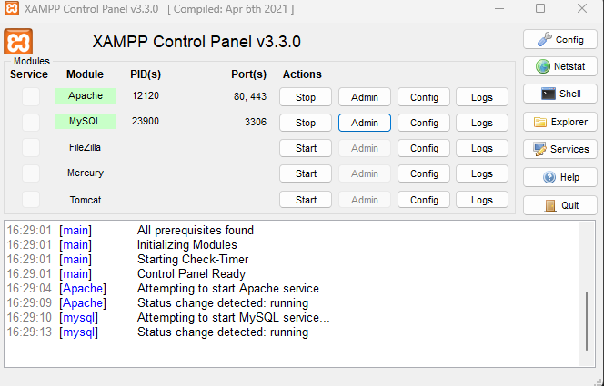
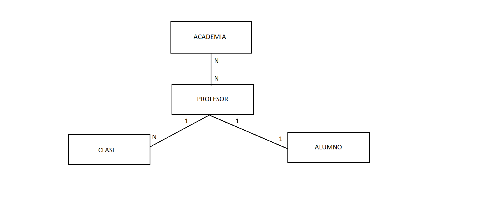

# AE3. JPA

# ¿Qué es JPA?

JPA → Java Persistance API - API de persistencia de Java

Es una herramienta que permite a los desarrolladores de software trabajar con bases de datos relacionales utilizando el lenguaje de programación Java.

# ¿Qué utilidad tiene?

Con JPA, los desarrolladores pueden mapear objetos Java a tablas de bases de datos y realizar operaciones de lectura y escritura en ellas utilizando un conjunto de clases y métodos definidos por la API.

---

# Creación del proyecto

Para la ejecución de nuestro proyecto primero prepararemos el entorno, para ello utilizaremos el programa eclipse.

Tendremos que tener un gestor de base de datos y un servidor, en este caso hemos optado por el XAMPP porque facilita ambos pudiendo activarlos y desactivarlos fácil. También podremos acceder a la base de datos con rapidez.

<p align="center">
  
</p>

Crearemos un proyecto maven. Una vez creado el proyecto tendremos que configurar el Java que queramos usar en el proyecto y añadir el JDK correspondiente.

Dentro del proyecto los dos archivos a configurar antes de comenzar son el pom.xml donde insertaremos las dependencias y propiedades para que nuestro proyecto funcione.

```xml
<properties>
  <maven.compiler.target>11</maven.compiler.target>
  <maven.compiler.source>11</maven.compiler.source>
</properties>
```

Con esta propiedad controlamos que versión de maven vamos a utilizar para compilar el proyecto.

En las dependencias tendremos la versión de la base de datos y conector.

```xml
<dependency>
  <groupId>mysql</groupId>
  <artifactId>mysql-connector-java</artifactId>
  <version>8.0.27</version>
</dependency>
```

Y la herramienta de mapeo **hibernate**, que sirve para la relación de los objetos.

```xml
<dependency>
  <groupId>org.hibernate</groupId>
  <artifactId>hibernate-core</artifactId>
  <version>5.4.21.Final</version>
</dependency>
```

En la carpeta por defecto de resources añadiremos una carpeta META-INF y dentro un archivo persistence.xml que sirve para definir la base de datos y cuales entidades vamos a salvar dentro de ella.

## Persistence.xml

### Formato

- name → indicamos el nombre del proyecto

```xml
<?xml version="1.0" encoding="UTF-8"?>
<persistence version="2.1" xmlns="http://xmlns.jcp.org/xml/ns/persistence" xmlns:xsi="http://www.w3.org/2001/XMLSchema-instance" xsi:schemaLocation="http://xmlns.jcp.org/xml/ns/persistence http://xmlns.jcp.org/xml/ns/persistence/persistence_2_1.xsd">
  <persistence-unit name="bbdd2" transaction-type="RESOURCE_LOCAL">

  </persistence-unit>
</persistence>
```

### Beans

- Cada beans que necesitemos comunicar con la bd lo tendremos que añadir

```xml
<class>edix.modelo.entidad.Autor</class>
<class>edix.modelo.entidad.Editorial</class>
<class>edix.modelo.entidad.Libreria</class>
<class>edix.modelo.entidad.Libro</class>
```

### Conexión con la bd

1. Indicamos el driver de conexión.
2. Indicamos donde se localiza la bd.
3. Indicamos el user para conectarnos a la bd
4. Crearemos la base de datos cuando se arranque el programa
5. En caso de que este creada la borraremos y crearemos
6. Se utiliza para mostrar los dialectos de hibernate

```xml
<properties>
  <property name="javax.persistence.jdbc.driver" value="com.mysql.cj.jdbc.Driver"/>
  <property name="javax.persistence.jdbc.url" value="jdbc:mysql://localhost:3306/bbdd2"/>
  <property name="javax.persistence.jdbc.user" value="root"/>
  <property name="javax.persistence.schema-generation.database.action" value="create"/>
  <property name="javax.persistence.schema-generation.database.action" value="drop-and-create"/>

  <property name = "hibernate.show_sql" value = "true" />
  <property name = "hibernate.dialect" value = "org.hibernate.dialect.MySQL8Dialect" />
</properties>
```

Para la creación de la base de datos necesitamos las siguientes anotaciones:

# Beans

## @Entity

Se utiliza para indicar que una clase es una entidad y que se debe mapear a una tabla en una base de datos relacional.

```java
@Entity
public class Autor{

}
```

## @Table(name = “autores”)

Se utiliza para indicar el nombre que tendrá la tabla donde guardaremos los datos.

```java
@Entity
@Table(name = "autores")
public class Autor{

}
```

## @Id

Se aplica a una variable y estaremos indicando que esta será la clave primaria en la tabla de la base de datos

```java
@Id
private int id;
```

## @GeneratedValue(strategy = GenerationType.IDENTITY)

Con esta anotación estamos indicando que la clave primaria se autoincrementara.

Por tanto, no tendremos que pasar ese dato al crear registro.

```java
@Id
@GeneratedValue(strategy = GenerationType.IDENTITY)
private int id;
```

# @Temporal(TemporalType.Date)

Indicamos como será el formato del campo que se enviara a la bd

| Nombre | Uso | Ejemplo |
| --- | --- | --- |
| TemporalType.DATE | solo fecha | 2021-02-07 |
| TemporalType.TIME | solo hora | 20:44:34 |
| TemporalType.TIMESTAMP | fecha y hora | 2021-02-07 20:44:34 |

```java
@Temporal(TemporalType.DATE)
private Date fecha_nac;
```

Dentro de cada clase para poder relacionar con otra tenemos que tener claro por el esquema de entidad-relación que tipo de relación tienen y asignársela.

# @OneToMany

Esta anotación indica que la relación entre las entidades es de “uno a muchos”. (un cliente puede tener muchos pedidos)

> Esta anotación para las **relaciones bidireccionales ES OBLIGATORIA** en la que tiene la FK (la clase pedido)
> 

| Nombre | Uso |
| --- | --- |
| mappedBy | Hay que decirle con cual de todos los posibles atributos de tipo cliente que tiene la clase DatosBancarios, es el con el que nos estamos relacionando (en este caso solo hay uno) |
| cascade | Representan como deben de comportarse los objetos a los cuales estamos referenciado desde este objeto |

## CascadeType

| CascadeType | Uso |
| --- | --- |
| ALL | Siempre que hagamos cualquier acción sobre un cliente, reaccionamos de igual manera con sus datos bancarios.

Ejemplo si borramos un cliente borramos sus datos bancarios asociados, si damos de alta un cliente, daremos también de alta sus datos bancarios asociados. |
| PERSIST | Solo en caso que demos de ALTA un cliente daremos de alta sus datos bancarios |
| REMOVE | Solo en caso que demos de BAJA un cliente daremos de baja sus datos bancarios |

```java
@OneToMany(mappedBy= "autor" , cascade = CascadeType.ALL)
private List<Libro> listalibrosAutor;
```

# @ManyToOne

Usando la etiqueta @ManyToOne estaremos haciendo una relación unidireccional.

## @JoinColumn

- name → Le damos nombre a la columna
- referencedColumnName → decimos a que columna de la tabla clientes hacemos referencia.

```java
@ManyToOne(cascade = CascadeType.PERSIST)
@JoinColumn(name = "fk_id_autor", referencedColumnName = "id")   
private Autor autor;
```

Con respecto al código generaremos cuatro clases:

## Editorial.java

```java
@Entity
@Table(name="editoriales")
public class Editorial {

  @Id
  @GeneratedValue(strategy = GenerationType.IDENTITY)
  private Integer id;
  private String nombre;
  private String direccion;
	
	
  @OneToMany(mappedBy = "editorial", cascade=CascadeType.ALL)
  private List<Libro> libros;
```

## Autor.java

```java
@Entity
@Table(name = "autores")
public class Autor {

  @Id
  @GeneratedValue(strategy = GenerationType.IDENTITY)
  private Integer id;
  private String nombre;
  private String apellidos;
	
  @Temporal(TemporalType.DATE)
  private Date fecha_nac;
	
  @OneToMany(mappedBy= "autor" , cascade = CascadeType.ALL)
  private List<Libro> listalibrosAutor;
```

## Libreria.java

# @ManyToMany

Esta anotación nos crea una tabla intermedia con las FK y PK de las otras tablas (no podremos modificar los datos de esta tabla)

```java
@Entity
@Table(name = "librerias")
public class Libreria {

  @Id
  @GeneratedValue(strategy = GenerationType.IDENTITY)
  private Integer id;
  private String nombre;
  private String dueño;
  private String direccion;
	
  @ManyToMany(mappedBy = "librerias", cascade = CascadeType.PERSIST)
  private List<Libro> libros;
```

En Libro.java tendremos una anotación que se relacionara con el ManyToMany de Libreria

# Libro.java

Como en **Editorial.java** y **Autor.java** tienen una anotación @OneToMany en esta clase tendremos que colocar la anotación @ManyToOne

## @JoinColumn

Referencia a la columna que quiere unirse de la otra Entidad

- name → Le damos nombre a la columna
- referencedColumnName → decimos a que columna de la tabla clientes hacemos referencia.

## @ManyToMany

- name → El nombre de la tabla intermedia
- joinColumns → Las columnas FK y PK que aporta esta entidad (LIBRERIA)
- inverseJoinColumns → Las columnas FK y PK que me aporta la otra Entidad (LIBRO)
    1. FK que aporta Comercial
    2. FKs que aportan el resto de entidades

```java
@Entity
@Table(name = "libros")
public class Libro {
	
  @Id
  @GeneratedValue(strategy = GenerationType.IDENTITY)
  private Integer id;
  private String titulo;
  private double precio;
	
  @ManyToOne(cascade = CascadeType.PERSIST)
  @JoinColumn(name = "fk_id_edito", referencedColumnName = "id")
  private Editorial editorial;
	
  @ManyToOne(cascade = CascadeType.PERSIST)
  @JoinColumn(name = "fk_id_autor", referencedColumnName = "id")   
  private Autor autor;
	
  @ManyToMany(cascade = CascadeType.PERSIST)
  @JoinTable(name = "libreria_libro",
  joinColumns = @JoinColumn(name = "fk_id_libro", referencedColumnName = "id"),//1
  inverseJoinColumns = @JoinColumn(name = "fk_id_libreria", referencedColumnName = "id"))//2
  private List<Libreria> librerias;
```

# 🗃️edix.vista

# 📔Main.java

Establecer la conexión con la base de datos

Para trabajar con JPA necesitamos un objeto `EntityManager`, nos permitirá:

- Abrir/Cerrar las conexiones con la base de datos.
- Realizar las transacciones.
- Cacheara en memoria las consultas realizadas para así liberar la base de datos.

Para crear un objeto `EntityManager` tendrá que estar apoyado en una `EntityManagerFactory` dicha factoría estará asociada a una unidad de persistencia definido en el persistance.xml

<p align="center">
  
</p>

### 📡abrirConexion y 📡cerrarConexion

Crearemos 2 métodos que nos permitirá abrir/cerrar las conexiones con la base de datos

```java
private static EntityManagerFactory emf;
private static EntityManager em;

public static boolean abrirConexion() {
  //comprobaremos si se puede establecer la comunicacion cn la bd
  try {
    emf = Persistence.createEntityManagerFactory("bbdd2");
    em = emf.createEntityManager();
    return true;
  } catch (Exception e) {
    System.out.println(e.getMessage());
    return false;
  }
}

public static boolean cerrarConexion() {
  try {
    em.close();
    emf.close();
    return true;
  } catch (Exception e) {
    System.out.println(e.getMessage());
    return false;
  }
}
```

### 📡add

Este método que permita añadir datos a la bd

- La siguiente acción en la base de datos
    1. Abrimos canal de transaccionalidad.
    2. Empezamos la transacción.
    3. Guardamos el objeto persona en la bd.
    4. Hacemos commit de la consulta.

```java
private static EntityTransaction et;

public static boolean add(Autor autor) {
  try {
    et = em.getTransaction();//1
    et.begin();//2
    em.persist(autor);//3
    et.commit();//4
    return true;
  } catch (Exception e) {
    System.out.println(e.getMessage());
    return false;
  }
}
```

### 📡añadirDatos

Usaremos este método para crear los datos en variables locales y luego poder añadirlos a la bd con el método add.

```java
public static void añadirDatos() {

  Editorial ed1 = new Editorial("SM", "calle el cuco");
  Editorial ed2 = new Editorial("Anaya ", "calle caiman");
	
  Libreria libreria1 = new Libreria("Casa del Libro", "Nicolás María Urgoiti", "C/ Gran Vía, 29, 28013");
  Libreria libreria2 = new Libreria("La Central", "Antonio Ramírez", "Rda. de Atocha, 2, 28012");
	
  Autor aut1 = new Autor("Junji", "ito", new Date(31,7,63));//1 4 7
  Autor aut2 = new Autor("Michel", "Houellebecq", new Date(26,2,56));//2 5 8
  Autor aut3 = new Autor("Stephen", "King", new Date(21,9,47));//3 6
	
  Libro libro1 = new Libro("Uzumaki", 23.75);
  Libro libro2 = new Libro("Serotonina", 9.49);
  Libro libro3 = new Libro("El resplandor", 6.64);
  Libro libro4 = new Libro("Tomie", 23.75);
  Libro libro5 = new Libro("Sumisión", 12.34);
  Libro libro6 = new Libro("Cuento de hadas", 14.34);
  Libro libro7 = new Libro("Gyo", 21.75);
  Libro libro8 = new Libro("Aniquilación", 9.49);
```

- Una vez instanciados los objetos, procedemos a guardar uno a uno en cada objeto.
Cruzaremos los datos guardados entre los diferentes objetos.
    - Como vemos en el primer caso con libro, primero le asignamos un autor y al mismo autor le asignamos el libro. Al libro le asignamos una editorial y a la editorial el libro.

```java
//añadiendo los datos de los libros

//      libro1
libro1.setAutor(aut1);
aut1.addLibro(libro1);
libro1.setEditorial(ed1);
ed1.addLibro(libro1);

//      libro2
libro2.setAutor(aut2);
aut2.addLibro(libro2);
libro2.setEditorial(ed2);
ed2.addLibro(libro2);

//      libro3
libro3.setAutor(aut3);
aut3.addLibro(libro3);
libro3.setEditorial(ed1);
ed1.addLibro(libro3);

//      libro4
libro4.setAutor(aut1);
aut1.addLibro(libro4);
libro4.setEditorial(ed1);
ed1.addLibro(libro4);

//      libro5
libro5.setAutor(aut2);
aut2.addLibro(libro5);
libro5.setEditorial(ed2);
ed2.addLibro(libro5);

//      libro6
libro6.setAutor(aut3);
aut3.addLibro(libro6);
libro6.setEditorial(ed1);
ed1.addLibro(libro6);

//      libro7
libro7.setAutor(aut1);
aut1.addLibro(libro7);
libro7.setEditorial(ed1);
ed1.addLibro(libro7);

//      libro8
libro8.setAutor(aut2);
aut2.addLibro(libro8);
libro8.setEditorial(ed1);
ed1.addLibro(libro8);
```

- Creamos unas listas donde guardaremos cada libro y al libro se le asignará una lista. Realizaremos lo mismo con el objeto libro y librería

```java
List<Libreria> lstLibreria1 = new ArrayList<>();
List<Libreria> lstLibreria2 = new ArrayList<>();
List<Libro> lstlibros1 = new ArrayList<>();
List<Libro> lstlibros2 = new ArrayList<>();

lstLibreria1.add(libreria1);
lstlibros1.add(libro1);
lstlibros1.add(libro3);
lstlibros1.add(libro5);
lstlibros1.add(libro7);

lstLibreria2.add(libreria2);
lstlibros2.add(libro2);
lstlibros2.add(libro4);
lstlibros2.add(libro6);
lstlibros2.add(libro8);

libro1.setLibrerias(lstLibreria1);
libro3.setLibrerias(lstLibreria1);
libro5.setLibrerias(lstLibreria1);
libro7.setLibrerias(lstLibreria1);
libreria1.setLibros(lstlibros1);

libro2.setLibrerias(lstLibreria2);
libro4.setLibrerias(lstLibreria2);
libro6.setLibrerias(lstLibreria2);
libro8.setLibrerias(lstLibreria2);
libreria2.setLibros(lstlibros2);
```

> Comprobamos que se pueda persistir los datos a la bd usando el método add.
> 

```java
if(add(aut1) || add(aut2) || add(aut3)) {
  System.out.println("Se añadieron los datos a la bd");
}else{
  System.out.println("Error al añadir los datos a la bd");
}
```

Como podemos ver por consola demuestra que crea todas las tablas en la base de datos.

<p align="center">
  
</p>

## Base de datos

- Este será el esquema de la base de datos que se generara al arrancar el programa.

<p align="center">
  
</p>

## Listados de elementos

Tendremos un menú que nos permitira ver las diferentes listas que solicitaremos a la bd

<p align="center">
  
</p>

### Opción 1

- Mostrar todos los libros dados de alta, con su editorial y su autor
    
    
1. Para eso guardamos en una lista el resultado de una Query a la base de datos en la que solicitamos la lista de la tabla **libros**.
2. Usando un bucle de la lista iremos pintando los resultados

```java
@SuppressWarnings("unchecked")
public static void listaLibros(){
  try {
    List<Libro> lstLibro = em.createQuery("from Libro libros").getResultList();//1
    System.out.println("\n-------------Lista de Libros-------------");
    for(Libro libro : lstLibro) {//2
        System.out.println("Titulo " + libro.getTitulo() + 
                        "\n\tAutor " + libro.getAutor().getNombre() + 
                        " Editorial " + libro.getEditorial().getNombre());
    }
    System.out.println();
  } catch (Exception e) {
    System.out.println(e.getMessage());
    System.out.println("Error al sacar la lista");
  }
}
```

<p align="center">
  
</p>

### Opción 2

- Mostrar todos los autores dados de alta, con sus libros asociados

1. Para eso guardamos en una lista el resultado de una Query a la base de datos en la que solicitamos la lista de la tabla **autores**.
2. Usando un bucle de la lista iremos pintando el nombre del autor
    1. Y por cada autor el nombre de sus libros

```java
@SuppressWarnings("unchecked")
public static void listaAutores() {
  try {
    List<Autor> lstAutor = em.createQuery("from Autor autores").getResultList();
    System.out.println("\n-------------Lista de Autores-------------");
    for(Autor autor : lstAutor) {
      System.out.println("Nombre " + autor.getNombre());
      for(Libro libro: autor.getListalibrosAutor()) {
        System.out.println("\tLibro " + libro.getTitulo());
					
      }
    System.out.println();
    }
			
  } catch (Exception e) {
    System.out.println(e.getMessage());
    System.out.println("Error al sacar la lista");
}
```

<p align="center">
  
</p>

### Opción 3

- Mostrar todas las librerías, con solamente sus libros asociados

1. Para eso guardamos en una lista el resultado de una Query a la base de datos en la que solicitamos la lista de la tabla **librerías**.
2. Usando un bucle de la lista iremos pintando el nombre de la librería
    1. Y por cada librería el nombre de los libros que tenga.

```java
@SuppressWarnings("unchecked")
public static void listaLibrerias() {
  try {
    List<Libreria> lstLibreria = em.createQuery("from Libreria librerias").getResultList();
    System.out.println("\n-------------Lista de Librerias-------------");
    for(Libreria libreria: lstLibreria) {
      System.out.println("Nombre " + libreria.getNombre());
      for(Libro libro: libreria.getLibros()) {
          System.out.println("\tLibro " + libro.getTitulo());
					
      }
      System.out.println();
    }
			
  } catch (Exception e) {
    System.out.println(e.getMessage());
    System.out.println("Error al sacar la lista");
  }
}
```

<p align="center">
  
</p>

### Opción 4

- Mostrar todos los libros dados de alta, y en la librería en la que están.

1. Para eso guardamos en una lista el resultado de una Query a la base de datos en la que solicitamos la lista de la tabla **libros**.
2. Usando un bucle de la lista iremos pintando el nombre del libro
    1. Y por cada libro el nombre de las librerías donde se vende ese libro.

```java
@SuppressWarnings("unchecked")
public static void listaLibrosEnLibreria() {
  try {
    List<Libro> lstLibro = em.createQuery("from Libro libros").getResultList();
    System.out.println("\n-------------Lista de Libros en Librerias-------------");
    for(Libro libro: lstLibro) {
      System.out.println("Nombre " + libro.getTitulo());
      for(Libreria libreria: libro.getLibrerias()) {
        System.out.println("\tLibreria " + libreria.getNombre());		
      }

      System.out.println();
    }
			
  } catch (Exception e) {
    System.out.println(e.getMessage());
    System.out.println("Error al sacar la lista");
  }
}
```

<p align="center">
  
</p>

### Opción 5

- Salimos de la ejecución del programa y además llamamos al método cerrarConexion

<p align="center">
  
</p>

# JAXB

## ¿Qué es JAXB?

JAXB → Java Architecture for XML Binding - Arquitectura Java para enlace XML

Es una biblioteca de Java que permite la conversión automática de documentos XML en objetos Java y viceversa. Es útil para simplificar el proceso de lectura y escritura de documentos XML en aplicaciones Java.

## ¿Qué utilidad tiene?

JAXB es una herramienta de Java que se utiliza para mapear objetos Java a documentos XML y viceversa. Es útil para simplificar la creación y manipulación de documentos XML en aplicaciones Java.

---

### ¿Cómo sacamos datos en formato XML?

- Debemos de realizar una serie de anotaciones en las entidades para que muestre por consola los datos indicados.

### @XmlRootElement

- name → será la cabecera del objeto que presenta.

### @XmlType

- propOrder → Indicaremos el nombre de las columnas de las tablas, para luego pasarlo a xml.

```java
@XmlRootElement (name="autor")
@XmlType(propOrder = {
    "id",
    "nombre",
    "apellidos",
    "fecha_nac",
    "listalibrosAutor"
  })
```

Para hacer que se muestren los datos almacenados con la estructura que hemos creado anteriormente con las anotaciones, tenemos un objeto JAXBContext y un objeto Marshaller

```java
private static JAXBContext contexto;
private static Marshaller m;
```

- Dentro del main, instanciamos la clase contexto.
En este caso lo try-catcheamos por si muestra algún error en el proceso.

```java
public static void Contexto() {
  try {
    contexto= JAXBContext.newInstance(Autor.class);
	
  }catch (JAXBException e) {
    System.out.println("Error creando el contexto");
    System.out.println(e.getMessage());
	  e.printStackTrace();
    return;
  }
}
```

Crearemos un try para crear un Objeto Marshaller y devolver la forma de salida a  XML.

```java
m = contexto.createMarshaller();
m.setProperty(Marshaller.JAXB_FORMATTED_OUTPUT, true);
```

## Insertamos los datos

```java
Editorial ed1 = new Editorial("SM", "calle el cuco");
Editorial ed2 = new Editorial("Anaya ", "calle caiman");

Libreria libreria1 = new Libreria("Casa del Libro", "Nicolás María Urgoiti", "C/ Gran Vía, 29, 28013");
Libreria libreria2 = new Libreria("La Central", "Antonio Ramírez", "Rda. de Atocha, 2, 28012");

Autor aut1 = new Autor("Junji", "ito", new Date(31,7,63));//1 4 7
Autor aut2 = new Autor("Michel", "Houellebecq", new Date(26,2,56));//2 5 8
Autor aut3 = new Autor("Stephen", "King", new Date(21,9,47));//3 6

Libro libro1 = new Libro("Uzumaki", 23.75);
Libro libro2 = new Libro("Serotonina", 9.49);
Libro libro3 = new Libro("El resplandor", 6.64);
Libro libro4 = new Libro("Tomie", 23.75);
Libro libro5 = new Libro("Sumisión", 12.34);
Libro libro6 = new Libro("Cuento de hadas", 14.34);
Libro libro7 = new Libro("Gyo", 21.75);
Libro libro8 = new Libro("Aniquilación", 9.49);
```

Los insertamos en el objeto Marshaller y los sacamos por consola

```java
System.out.println("\n"+"----------LIBRERIAS----------"+ "\n");
m.marshal(libreria1, System.out);
m.marshal(libreria2, System.out);

System.out.println("\n"+ "----------LIBROS----------"+ "\n");
m.marshal(libro1, System.out);
m.marshal(libro2, System.out);
m.marshal(libro3, System.out);
m.marshal(libro4, System.out);
m.marshal(libro5, System.out);
m.marshal(libro6, System.out);
m.marshal(libro7, System.out);
m.marshal(libro8, System.out);

System.out.println("\n"+"----------AUTORES----------"+ "\n");
m.marshal(aut1, System.out);
m.marshal(aut2, System.out);
m.marshal(aut3, System.out);
System.out.println("\n"+"----------EDITORIALES----------"+ "\n");
m.marshal(ed1, System.out);
m.marshal(ed2, System.out);
```

Cerramos con un catch para obtener los posibles fallos durante la ejecución

```java
catch (JAXBException e) {
  System.out.println("Error convertiendo el objeto a formato XML");
  System.out.println(e.getMessage());
  e.printStackTrace();
}
```

Este seria uno de los muchos registro que muestra en formato XML

<p align="center">
  
</p>


# Creación de un nuevo esquema de bd

Para este requerimiento hemos llegado a la conclusión que una Academia es buen ejemplo por las relaciones que podemos encontrar.

<p align="center">
  
</p>

## Beans

### Academia.java

- Academia tiene una relación muchos a muchos con profesores.

```java
@Entity
@Table(name = "academia")
public class Academia {

  @Id
  @GeneratedValue(strategy = GenerationType.IDENTITY)
  private Integer id_academia;
  private String nombre_academia, direccion;
	
  @ManyToMany (mappedBy = "listaAcademias", cascade = CascadeType.PERSIST)
  private List<Profesor> listaProfesores;

}
```

### Alumno.java

- El alumno tiene relación uno a uno con el profesor

```java
@Entity
@Table(name="alumnos")
public class Alumno {

  @Id
  @GeneratedValue(strategy = GenerationType.IDENTITY)
  private Integer id_alumno;
  private String nombre, apellido;
	
  @OneToOne (mappedBy = "alumno", cascade = CascadeType.PERSIST)
  private Aula letra; 
}
```

### Aula.java

- En la entidad aula tiene una relación muchos a uno con profesor.

```java
@Entity
@Table(name="aulas")
public class Aula {

  @Id
  @GeneratedValue(strategy = GenerationType.IDENTITY)
  private Integer id_aula;
	
  @OneToOne
  @JoinColumn(name = "fk_letra_clase", referencedColumnName = "letra")
  private String letra;
	
  @ManyToOne
  @JoinColumn (name = "Fk_id_profesor", referencedColumnName = "id_profesor")
  private Profesor profesor;
	
}
```

### Profesor.java

- La entidad profesor tiene la relación uno a muchos al aula y muchos a muchos con la academia. Para terminar tiene uno a uno con el alumno.

```java
@Entity
@Table(name="profesores")
public class Profesor {

  @Id
  @GeneratedValue(strategy = GenerationType.IDENTITY)
  private Integer id_profesor;
  private String nombre;
  private String apellido;
	
  @OneToMany (mappedBy = "aula", cascade = CascadeType.PERSIST)
  private Aula aula;
	
  @ManyToMany (mappedBy = "listaProfesores", cascade = CascadeType.PERSIST)
  private List<Academia> listaAcademias;
	
}
```