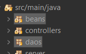

# A1 Hilos y Sockets

# Cliente.java

En el cliente tenemos que indicar los puertos que vamos a utilizar para conectarnos al servidor.

```java
public static final int PORT = 2000;
public static final String IP_SERVER = "localhost";
//(Podriamos usar la ip del servidor en vez del localhost)
```

servDirection → Es un objeto que almacena los datos de conexión al servidor.

```java
InetSocketAddress servDirection = new InetSocketAddress(IP_SERVER, PORT);
```

Queremos que cuando termine la ejecución se cierre todo lo que se ha creado.
Para eso utilizaremos el bloque try-catch (cuando salgamos del try se cerrara la conexión).

Creamos un escáner para que podamos leer los datos introducidos en la terminal del cliente

```java
try (Scanner sc = new Scanner(System.in)){
```

socketToServ→ Nos va a permitir comunicarnos con el servidor

```java
Socket socketToServ = new Socket();
```

Usando socketToServ realizaremos la conexión con el servidor pasando el objeto con los datos del servidor (servDirection).

```java
socketToServ.connect(servDirection);
```

InputStreamReader → Es por donde el cliente recibirá los datos del cliente.

```java
InputStreamReader input = new InputStreamReader(socketToServ.getInputStream());
```

Como el método InputStreamReader() lee datos carácter a carácter -> ejemplo h o l a

Tendremos que unirlo en una sola cadena, para eso usaremos BufferedReader

```java
BufferedReader buffer = new BufferedReader(input);
```

Ahora mismo podemos recibir información del servidor pero como también tenemos que enviarla utilizaremos

PrintStream → Es un objeto que nos permite enviar información al servidor.

```java
PrintStream out = new PrintStream(socketToServ.getOutputStream());
```

Por ultimo antes de acceder al do tenemos que crear:

- Un Mensaje donde informaremos la acción que queremos hacer al servidor
- Y un booleano que se utilizara para cerrar la conexión en caso de querer salir del programa.

```java
String InfoActions = "";
boolean continues = true;
```

Justo al entrar al do pintaremos por terminal el menú de acción que podrá usar nuestro cliente quedando de la siguiente manera

```bash
########################
Insert a option:
 1. Search by ISBN"
 2. Search by Tittle
 3. Search by Author
 4. Add book
 5. Exit
```

⚠️Este menú aparecerá siempre que finalicemos cualquier acción⚠️

1. Almacenamos la opción que desea usar el cliente
2. Mandamos al servidor la opción

```java
InfoActions = sc.nextLine();//1
out.println(InfoActions);//2
```

Y esperaremos a que el servidor nos responda.

```java
String result = buffer.readLine();
```

Si se introdujo una opción **diferente** a 5 pintaremos en la terminal el resultado enviado por el servidor.

```java
System.out.println(result);
```

Si se introdujo la opción 5 (Exit) cambiamos continues a false de tal manera que saldremos del while y cerraremos la conexión.

Luego tenemos la zona de las excepciones donde nos informará de los errores

---

# Server.java

Dentro del servidor indicamos el puerto por el cual vamos a estar escuchando y la ip que utilizaremos en este caso será localhost.

```java
private static final int PORT=2000;
private static final String IP_SERVER = "localhost";
```

ServerSocket  → Es el foco el cual recibirá las solicitudes.

```java
try (ServerSocket serverSocket = new ServerSocket())
```

Guardamos la dirección que se declaro al inicio del archivo.

```java
InetSocketAddress direction = new InetSocketAddress(IP_SERVER,PORT);
```

Vinculamos el ServerSocket a la dirección (direction).

```java
serverSocket.bind(direction);
```

Ahora el servidor creara un socket diferente por cada petición del cliente aceptada

```java
Socket socket = serverSocket.accept();
```

Justo después crearemos un hilo nuevo liberando el hilo de solicitudes para que así se pueda recibir mas peticiones

```java
new ServerThread(socket, "thread-" + direction.getHostName());
```

Por ultimo tenemos la zona de Excepciones la cual nos mostrara los errores

---

# ScreenStream.java

Esta clase será utilizada por ServerThread.java para cerrar y leer las comunicaciones con el cliente.
No es necesaria tenerla, pero nos ahorrara líneas en el otro archivo

Para ello declaramos las variables

```java
private InputStreamReader charReader;
private BufferedReader lineReader;
```

Y las iniciamos dentro del controlador

```java
public ScreenStream(InputStream inputStream) {
  this.charReader = new InputStreamReader(inputStream);
  this.lineReader = new BufferedReader(charReader);
}
```

Para poder cerrar la entrada de flujo de datos creamos el método close()

1. indicamos que vamos a cerrar la conexión.

```java
public void close() throws IOException {
  lineReader.close();//1
  charReader.close();//1
}
```

Para leer los mensajes del cliente creamos el método read()

Este método se quedara parado hasta que recibamos un String del cliente

```java
public String read() throws IOException {
  return lineReader.readLine();
}
```

---

# SereverThread.java

Aquí se procesa la ejecución de las opciones del programa con el fin de generar un objeto ServerThread que tiene los siguientes atributos:

Los atributos public son necesarios para poder acceder al output y al input del hilo,  *aunque en teoría solo es necesario especificar como public la entrada de datos de clientes(input); para evitar que otros objetos(sean o no de la misma clase) puedan utilizar el atributo de salida de datos hacia el cliente(output), interceptando la comunicación y enviar información que no estaba prevista en el objeto ServerThread.*

```java
private static int id;    // incrementa +1 por objeto de esta clase 
private String name;      // recuerda como ha sido nombrado el objeto
private long born;        // recuerda cuando ha sido creado el objeto

private Thread thread;    
private Socket socket;  
private BookDaoImpl book;

public PrintStream output; // para enviar datos al cliente
public ScreenStream input; // para recibir datos del cliente
public ArrayList<String> data;
```

1. Recibimos los valores y los guardamos
2. Iniciamos el ScreenStream para la entrada de datos.
3. Iniciamos el PrintStream para la salida de datos.
4. Arrancamos el hilo

```java
public ServerThread(Socket socket, String name) {
  id++; //Añadimos 1 para tener una acuenta de cuantos clientes hay conectados
  this.socket = socket;//1
  this.name = name + "-" + id;//1
  this.born = System.currentTimeMillis();//1
  this.book = new BookDaoImpl();//1

  try {
    this.input = new ScreenStream(socket.getInputStream());//2
    this.output = new PrintStream(socket.getOutputStream());//2
  }catch (Exception e) {
    System.out.println(e.getMessage());
  }

  this.thread = new Thread(this, "Cliente-" + id);//4
  this.thread.start();//4
  System.out.println(thread.getName() + " communication openned. ");
}
```

Resolución de las opciones introducidas por el servidor.

1. El servidor se quedaría aquí parado hasta que el cliente nos mande información, es decir, cuando haga un salida.println(INFORMACION);
2. Generamos el Arraylist con la entrada de información desde el cliente y lo guardamos en data
3. Dependiendo de la opción seleccionada accederemos a un if u otro.
Estos if funcionan de la misma manera usan un try-catch.
    1. Zona try → Enviara al cliente el resultado de la operación.
    2. Zona catch → Enviara al cliente un mensaje informando de un error
    
4. El if para la opción 4 funciona de una forma diferente.
Este if se limita a llamar a la función addOneBookOnTime() la explicaremos mas tarde.

1. Si la opción insertada es 5
Mandaremos un mensaje diciendo que cerraremos la conexión y cerramos el socket

```java
public void run() {
  System.out.println("Estableciendo comunicación con " + thread.getName());
  try {
    do {
      String str = input.read();//1
      String[] strSplit = str.split("-");//2
      data = new ArrayList<String>(Arrays.asList(strSplit));//2

      if (data.get(0).equalsIgnoreCase("1")) {//3
      // consultar por isbn
        try {//3.a
          output.println("" + book.findByIsbn(Integer.parseInt(data.get(1))));
        } catch (NumberFormatException e) {//3.b
          output.println("number format error");
        }
      }

      if (data.get(0).equalsIgnoreCase("2")) {//3
      // consultar por titulo
        try {//3.a
          output.println(book.findByTitle(data.get(1)));
        } catch (Exception e) {//3.b
          output.println("Exception ->" + e.getMessage());
        }
      }
      if (data.get(0).equalsIgnoreCase("3")) {//3
      // consultar por autor
        try {//3.a
          output.println(book.findByAuthor(data.get(1)));
        } catch (Exception e) {//3.b
          output.println("Exception ->" + e.getMessage());
        }
      }
      if (data.get(0).equalsIgnoreCase("4")) {//4
        // añadir libro
        addOneBookOnTime();
      }

    } while (!data.get(0).equalsIgnoreCase("5"));//5
      output.write("Hasta pronto, gracias por establecer conexión".getBytes());
      socket.close();

    } catch (IOException e) {
      System.out.println(e.getMessage());
    } finally {
      System.out.println(thread.getName() + " communication closed .");
    }
}
```

Función addOneBookOnTime()

Cuando se solicito esta opción nos pasaron una serie de datos.

1. Introducimos esos datos en addBook() que es un método de la clase Book guardamos el resultado de la operación en a.
2. comprobamos que el resultado de esa operación.
    1. 0 → Significa que se creo con éxito y mandamos un mensaje informando de esto.
    2. 1 → Significa que no se creo el libro.
        
        En este caso nos saltara un mensaje de error
        

```java
public synchronized void addOneBookOnTime() {
  try {
    //1
    int a = book.addBook(
      new Book(Integer.parseInt(data.get(1)), data.get(2), data.get(3), Integer.parseInt(data.get(1))));
    if (a==0) //2
      output.println("Book created. Thank you so much, nextime gonna to cry in stackoverflow");
  } catch (Exception e) {
    output.println("Exception -> " + e.getMessage());
  }
}
```

---

# Book

Los paquetes que vamos a utilizar para el libro serán el Beans y Daos



## Beans

El beans es donde declaramos que es lo que contiene un libro.

```java
private int ISBN;
private String title;
private String autor;
private int price;
```

Un constructor que nos permitirá crear libros

```java
public Book(int iSBN, String tittle, String autor, int price) {
  this.ISBN = iSBN;
  this.title = tittle;
  this.autor = autor;
  this.price = price;
}
```

Y un método toString para poder pintarlos.

## Daos

### 1. Interfaces

Se podría decir que es una plantilla que nos indica los métodos que tendrá el objeto libro

```java
public interface IntBookDao {
  List<Book> booksList();
  Book searchOne(int isbn);
  String findByIsbn(int isbn);
  String findByTitle(String tittle);
  int addBook(Book book);
  List<Book> findByAuthor(String Author);
}
```

### 2. Implements

Declaramos 2 ArrayList

1. lista → Es donde guardaremos todos los libros
2. listaAux → Esta lista estará vacía y será utilizada por un método que veremos a continuación 

```java
private ArrayList<Book> lista;
private ArrayList<Book> listaAux;
```

Ahora crearemos de forma local 5 libros

```java
private void loadBooks() {
  lista.add(new Book(1, "El coco 1", "antonio machado", 11));
  lista.add(new Book(2, "El coco 2", "antonio machado", 12));
  lista.add(new Book(3, "El coco 3", "antonio machado", 13));
  lista.add(new Book(4, "El coco 4", "antonio machado", 14));
  lista.add(new Book(5, "El coco 5", "antonio machado", 15));
}
```

Ahora iniciamos las variables y cargamos los libros dentro de lista.

```java
public BookDaoImpl() {
  lista = new ArrayList<Book>();
  listaAux = new ArrayList<Book>();
  loadBooks();
}
```

Para buscar libros por ISBN/Titulo

Lo hacemos de la siguiente manera:
1. Recorremos el Array lista.
2. Vamos comprobando si el libro en el que nos encontramos tiene el mismo ISBN que el que nos solicitaron.
3. De ser así devolvemos el numero.
4. En caso de que no exista ese ISBN devolveremos un null.

ISBN

```java
@Override
public String findByIsbn(int isbn) {
  for (Book book : lista) {//1
    if (book.getISBN() == isbn) {//2
      return book.toString();//3
    }
  }
  return null;//4
}
```

Titulo

```java
@Override
public String findByTitle(String title) {
  for (Book book : lista) {//1
    if (book.getTitle().equals(title)) {//2
      return book.toString();//3
    }
  }
  return null;//4
}
```

Para buscar por autor

1. Tendremos que limpiar el contenido de listaAux para así asegurarnos que no contiene nada.
2. Recorremos el Array lista.
3. Vamos comprobando si el libro en el que nos encontramos tiene el mismo autor que el que nos solicitaron.
4. Añadimos el libro al Array listaAux.
5. Devolvemos la nueva lista que contendrá todos los libros que tengan el mismo autor

```java
@Override
public List<Book> findByAuthor(String author) {
  listaAux.clear();//1

  for(Book book : lista){//2
    if(book.getAutor().equals(author)) {//3
      listaAux.add(book);//4
    }
  }
  return listaAux;//5
}
```

Para añadir un libro

1. Comprobamos si el libro que recibimos existe en la lista, de ser así devolveremos un 1.
2. Si no existe lo añadiremos a la lista y devolveremos un 0.

```java
public int addBook(Book book) {
  if(lista.contains(book)) {//1
    return 1;//1
  }
  lista.add(book);//2
  return 0;//2
}
```
