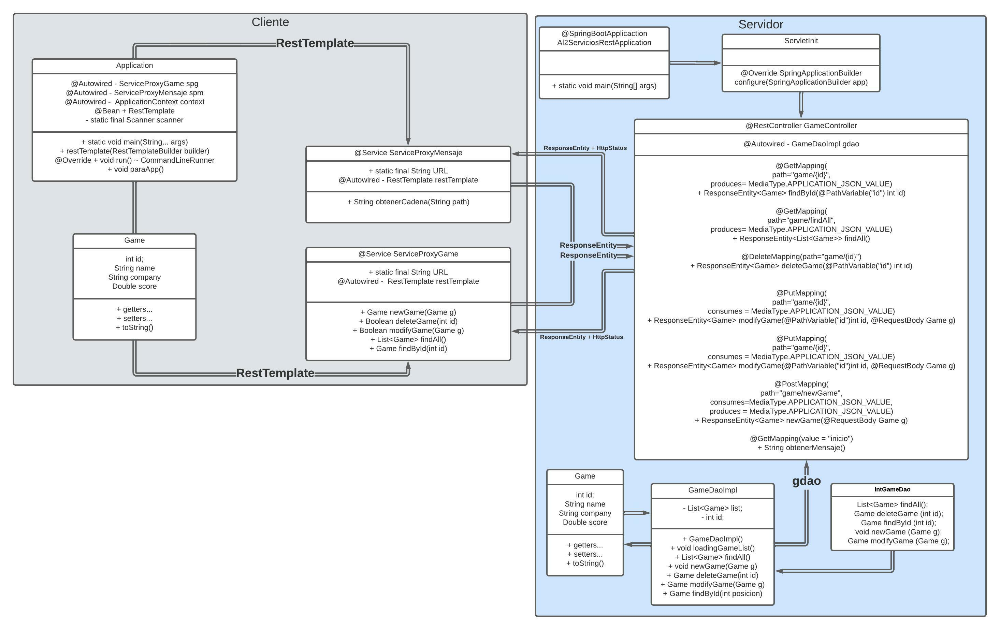
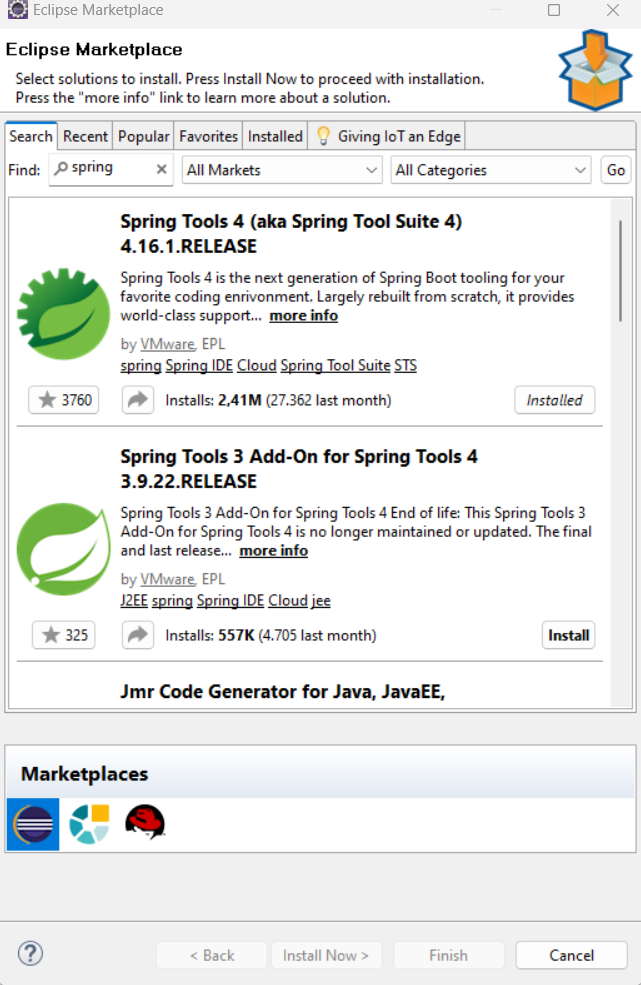
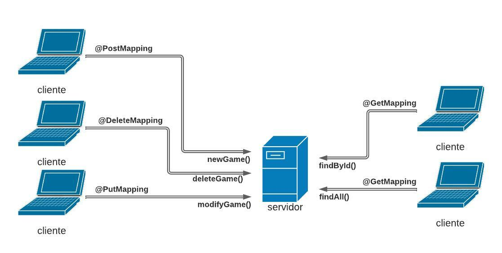

# A2 Servicio Rest

Para poder realizar nuestro servicio vamos a crear dos programas. 

- Servidor: Donde realizaremos las operaciones CRUD, en uno instauraremos el servidor y en la otra una simulación de consumo de un cliente.
- Cliente: Es una aplicación que consumirá el servidor solicitando las operaciones(Que ejecutara el servidor)

UML del ejercicio

<p align="center">
  
</p>

# Configuración del entorno

---

Para la configuración del entorno vamos a ir al help, Eclipse Marketplace y vamos a buscar Spring Tools 4 e instalarlo.

<p align="center">
  
</p>

Una vez instalado el Spring podremos crear el proyecto en la pestaña file, new, others, Spring Starter Proyect. 

Configuraremos la versión de java que utilizamos y le daremos grupo y nombre al proyecto.

Añadiremos el JRE que tenemos previamente instalado. Configurandolo en window, preferences, java, Installed JREs y ahi añadiremos el nuestro.

<p align="center">
  
</p>

También en preferences podremos añadir el servidor Tomcat pero en este caso vamos a utilizar el que tiene el propio programa embebido.

<p align="center">
  
</p>

# Servidor

---

El servidor recibe peticiones las cuales estas peticiones serán gestionadas gracias al GameController.java pero procesadas 

<p align="center">
  
</p>

## Configuración Básica

En la ruta src/main/resources se encuentra un archivo llamado application.properties en este archivo tendremos que indicar el puerto por el cual se recibirán las solicitudes.

```java
spring.main.allow-circular-references=true
server.port=8081
```

## Estructura de archivos

<p align="center">
  
</p>

## 🗃️Proyect.rest

### Al2ServiciosRestApplication.java

---

Esto es el punto donde se  arranca nuestra aplicación.

@SpringBootApplication

- Autoconfigura la aplicación para que se pueda desplegar.
- Busca anotaciones de Spring para accionar los métodos usando (get post..)
- Buscara los Bean de la aplicación y los encontrara gracias a @Bean

```java
@SpringBootApplication
public class Al2ServiciosRestApplication {

  public static void main(String[] args) {
    System.out.println("Cliente -> cargando el Spring");
    SpringApplication.run(Al2ServiciosRestApplication.class, args);
  }
}
```

### ServletInit.java

---

Clase que extiende de SpringBootServletInitializer; una clase que implementa la interfaz WebApplicationInitializer para ejecutar nuestra @SpringApplication desde un archivo WAR. Vinculándonos los beans @Servlet y @ServletContextInitializer en nuestro caso.

Lo hace sobrescribiendo el método SpringApplicationBuilder configure(…) pero también podríamos utilizar el inicializador @Configuration según la documentación oficial.

```java
public class ServletInit extends SpringBootServletInitializer{

  @Override
  protected SpringApplicationBuilder configure(SpringApplicationBuilder app) {
    return app.sources(Al2ServiciosRestApplication.class);
  }
}
```

## 🗃️Proyect.rest.beans

### Game.java

---

En esta clase se declara el Objeto que tendrá los siguientes datos además de sus respectivos getters y setters.

```java
int id;
String name;
String company;
Double score;
```

## 🗃️Proyect.rest.daos

### GameDaoImpl.java

---

Aquí cargamos una lista en memoria para que cuando se ejecute el servidor se inicie con algunos datos

```java
private void loadingGameList(){
  list.add(new Game(id++,"call of duty", "univision", 11.0));
  list.add(new Game(id++,"sims", "univision2", 12.0));
  list.add(new Game(id++,"warcraft", "univision3", 13.0));
  list.add(new Game(id++,"age of empires II", "univision4", 14.0));
  list.add(new Game(id++,"minecraft", "univision5", 15.0));
}
```

Además de eso tenemos los siguientes métodos.

- findAll → Devuelve la lista con todos los datos.
    
    ```java
    @Override
    public List<Game> findAll() {
      return list;
    }
    ```
    
- newGame → Crea un nuevo juego y lo añade a la lista
    
    ```java
    @Override
    public Game newGame(Game g) {
      for(Game game : list){
	    if(!(game.getName().equals(g.getName()))) {
          g.setId(id++);
          list.add(g);
          return g;
        }
      }
      return null;
    }
    ```
    
- deleteGame → Borra un juego de la lista
    
    ```java
    @Override
    public Game deleteGame(int id) {
      try {
        return list.remove(id);
      } catch (IndexOutOfBoundsException e) {
        System.out.println("delete -> Juego fuera de rango");
        return null;
      }
    }
    ```
    
- modifyGame → Recibimos el juego que se quiere modificar y le cambiamos los datos
    
    ```java
    @Override
    public Game modifyGame(Game g) {
      try {
        Game aux = list.get(g.getId());
        for(Game game : list){
          if(!(game.getName().equals(g.getName()))) {
            aux.setName(g.getName());
            aux.setCompany(g.getCompany());
            aux.setScore(g.getScore());
            return aux;
          }
        return null;	
    	} catch (IndexOutOfBoundsException e) {
          System.out.println("No se pudo añadir");
          return null;
        }
    }
    ```
    
- findById → Devolvemos el juego que se solicita
    
    ```java
    @Override
    public Game findById(int posicion) {
      try {
        return list.get(posicion);
      } catch (IndexOutOfBoundsException iobe) {
        System.out.println("No existe el juego");
        return null;
      }
    }
    ```
    

## 🗃️Proyect.rest.controller

### GameController.java

---

Aquí es donde se tramitaran todas las solicitudes del cliente, hay distintos tipos de solicitudes los mas importantes son:

- Get →  permite simplificar métodos de Spring MVC y los @RequestMapping entre otros.
- Put → Se utiliza para modificar/actualizar un recurso donde el cliente envía datos que actualiza el recurso ya existente.
- Post → asignar solicitudes HTTP POST a métodos de controlador específicos
- Delete → mapea solicitudes HTTP DELETE de forma más

Estos datos son recibidos por la URL de tal manera que si queremos borrar un juego la URI seria Delete→http://localhost:8081/2 pero la manera que tenemos de recibir ese 2 o un juego completo seria usando

- @PathVariable → indicamos que id queremos utilizar.
- @RequestBody → Se recibirá un objeto juego.

### findAll

- @GetMapping → indicamos que usaremos el método get
    - path → Indicamos la URL que se necesitara usar para accionar ese método.
    - produces → Además indicamos que devolverá el objeto juego en formato json.
1. Cuando se accede al método nos guarda en un array todos los datos de la lista.
2. Comprobamos que la lista tiene datos
    1. De ser así devolverá un código de respuesta 2XX utilizando el método http
    2. De no ser así nos devolverá un código de respuesta 404 utilizando el método http

```java
@GetMapping(path="game/findAll", produces= MediaType.APPLICATION_JSON_VALUE)
public ResponseEntity<List<Game>> findAll(){
  System.out.println("Buscando toda la lista");
  List<Game> g = gdao.findAll();//1
  if(g !=null) {//2
    return new ResponseEntity<List<Game>>(g,HttpStatus.OK);//2a
  }else {
    return new ResponseEntity<List<Game>>(HttpStatus.NOT_FOUND);//2b
  }	
}
```

### findById

- @GetMapping → indicamos que usaremos el método get
    - path → Indicamos la URL que se necesitara usar para accionar ese método.
    - produces → Además indicamos que devolverá el objeto juego en formato json.
- @PathVariable → recibimos un id por al url y lo almacenamos en la variable id
1. Cuando se accede al método nos devuelve un juego en caso de q exista.
2. Comprobamos que la variable tiene datos
    1. De ser así devolverá un código de respuesta 2XX utilizando el método http
    2. De no ser así nos devolverá un código de respuesta 404 utilizando el método http

```java
@GetMapping(path="game/{id}", produces= MediaType.APPLICATION_JSON_VALUE)
public ResponseEntity<Game> findById(@PathVariable("id") int id){
  System.out.println("Serching game...con ID: " + id);
  Game g= gdao.findById(id);//1
  if(g != null) {
    return new ResponseEntity<Game>(g,HttpStatus.OK);//2a
  }else {
    return new ResponseEntity<Game>(HttpStatus.NOT_FOUND);//2b
  }
}
```

### DelteGame

- @DeleteMapping→ indicamos que usaremos el método delete
    - path → Indicamos la URL que se necesitara usar para accionar ese método.
- @PathVariable → Recibimos un id por al url y lo almacenamos en la variable id
1. Cuando se accede al método borrara un juego en caso de que exista.
2. Comprobamos que la variable tiene datos
    1. De ser así devolverá un código de respuesta 2XX utilizando el método http
    2. De no ser así nos devolverá un código de respuesta 404 utilizando el método http

```java
@DeleteMapping(path="game/{id}")
public ResponseEntity<Game> deleteGame(@PathVariable("id") int id){
  System.out.println("ID del juego que se borrara: " + id);
  Game g = gdao.deleteGame(id);//1
  if(g != null) {//2
    return new ResponseEntity<Game>(g, HttpStatus.OK);//2a
  }else {
    return new ResponseEntity<Game>(g, HttpStatus.NOT_FOUND);//2b
  }
}
```

### NewGame

- @PostMapping→ indicamos que usaremos el método post
    - path → Indicamos la URL que se necesitara usar para accionar ese método.
    - consumes → Indica el tipo de formato que recibe
    - produces → Además indicamos que devolverá el objeto juego en formato json.
- @RequestBody → Recuperamos un objeto juego que se almacenara en g
1. Cuando se accede al método crea un juego.
2. Y devuelve un código de respuesta 201 avisa de q se creo con éxito

```java
@PostMapping(path="game/newGame", consumes=MediaType.APPLICATION_JSON_VALUE, produces=MediaType.APPLICATION_JSON_VALUE)
public ResponseEntity<Game> newGame(@RequestBody Game g){
  System.out.println("Se añadira el juego: " + g);
  gdao.newGame(g);//1
  return new ResponseEntity<Game>(g, HttpStatus.CREATED);//2
}
```

### modifyGame

- @PutMapping → indicamos que usaremos el método put
    - path → Indicamos la URL que se necesitara usar para accionar ese método.
    - consumes → Indica el tipo de formato que recibe
- @PathVariable → Recibimos un id por al url y lo almacenamos en la variable id
- @RequestBody → Recuperamos un objeto juego que se almacenara en g
1. Cuando se accede al método creamos un objeto juego el cual modificara los datos.
(Internamente esto se hace guardando en una variable el juego que tiene esa id y gestionando los nuevos datos).
2. Comprobamos que la variable tiene datos
    1. De ser así devolverá un código de respuesta 2XX utilizando el método http
    2. De no ser así nos devolverá un código de respuesta 404 utilizando el método http

```java
@PutMapping(path="game/{id}", consumes = MediaType.APPLICATION_JSON_VALUE)
public ResponseEntity<Game> modifyGame(@PathVariable("id")int id, @RequestBody Game g){
  System.out.println("juego q se modificara" + id);
  System.out.println("Nuevos datos " + g);
  g.setId(id);//1
  Game gmodif = gdao.modifyGame(g);//1
  if(gmodif != null) {//2
    return new ResponseEntity<Game>(HttpStatus.OK);//2a
  }else {
    System.out.println(gmodif);
    return new ResponseEntity<Game>(HttpStatus.NOT_FOUND);//2b
  }
}
```

# Cliente

---

<p align="center">
  
</p>

## Configuración Básica

En la ruta src/main/resources se encuentra un archivo llamado application.properties en este archivo tendremos que indicar el puerto por el cual se recibirán las solicitudes.

```java
spring.main.allow-circular-references=true
server.port=8080
```

<p align="center">
  
</p>

Para el proyecto dividiremos la carpeta src en paquetes. Entre los que se encuentran el paquete para el controlador del programa, el paquete para la clase y por ultimo el paquete donde se encuentran los servicios.

# 🗃️com.proyect.cliente

## Application.java

---

En esta clase importaremos los dos servicios con la anotación @Autowired

```java
@Autowired
private ServiceProxyMensaje spm;
	
@Autowired
private ApplicationContext context;
```

Importaremos un objeto RestTemplate para la utilización del mismo por los servicios en las peticiones.

```java
@Bean
public RestTemplate restTemplate(RestTemplateBuilder builder) {
  return builder.build();
}
```

Añadiremos una clase main para arrancar la aplicación con el proceso run

```java
public static void main(String[] args) {
  System.out.println("Accede??");		
  SpringApplication.run(Application.class, args);
}
```

Para poder realizar el CRUD desde la simulación del cliente vamos a crear un Scanner para que podamos introducir la opción que queramos.

Para empezar sugerimos un menú

```java
@Override
public void run(String... args) throws Exception {
  System.out.println(spm.obtenerCadena("inicio"));
  System.out.println("===========Iniciando Cliente Rest============");
  Boolean isRun = true;
  while (isRun == true) {
    System.out.println("1. Dar de alta un videojuego" + "\n" + "2. Dar de baja un videojuego por ID" + "\n"
    + "3. Modificar un videojuego por ID" + "\n" + "4. Obtener un videojuego por ID" + "\n"
    + "5. Listar todos los videojuegos" + "\n" + "6. Salir");

  String option = nextLine();
```

Cada opción tendrá su if:

- Alta:

Lo que haremos será pedir por consola los datos uno a uno y los insertaremos en el el juego que pasaremos a la lista creada en el Dao.

```java
if (option.equals("1")) {
  Game game = new Game();
  System.out.println("***Introducir el id***");
  String id = nextLine();
  game.setId(Integer.parseInt(id));
  System.out.println("***Introducir el nombre***");
  String name = nextLine();
  game.setName(name);
  System.out.println("***Introducir la Compañia***");
  String company = nextLine();
  game.setCompany(company);
  System.out.println("***Introducir la nota***");
  String score = nextLine();
  game.setScore(Double.parseDouble(score));
  Game gNuevo = spg.newGame(game);
	
  System.out.println("Juego dado de Alta: " + gNuevo);
  System.out.println("");

}
```

- Borrar

Buscaremos el objeto por id (siguiendo la referencia de la posición del array) para mas tarde borrarlo con el método.

```java
if (option.equals("2")) {
  System.out.println("***Introducir el id***");
  String id = nextLine();
	
  Boolean gBorrar = spg.deleteGame(Integer.parseInt(id));
  System.out.println("Juego eliminado: " + gBorrar + "\n");
}
```

- Modificar

Primero pediremos el id para realizar una búsqueda del juego en la lista, más tarde comprobaremos que el nombre insertado modificado no coincide con otro de la lista. Dejará que se repitan en la lista los datos de Score y Company.

```java
if (option.equals("3")) {
  System.out.println("***Introducir el id del juego a modificar***");
  String id = nextLine();
	
  Game gamemodif = new Game();
  gamemodif = spg.findById(Integer.parseInt(id));
  gamemodif.setId(Integer.parseInt(id));
  System.out.println("***Introducir un nuevo nombre***");
  String name = nextLine();
  if (name.equals(""))
    gamemodif.getName();
  gamemodif.setName(name);

  System.out.println("***Introducir la Compañia***");
  String company = nextLine();
	
  if (company.equals(""))
    gamemodif.getCompany();
  gamemodif.setCompany(company);

  System.out.println("***Introducir la nota***");
  String score = nextLine();
	
  if (score.equals(""))
    gamemodif.getScore();
  gamemodif.setScore(Double.parseDouble(score));

  Boolean gmodificar = spg.modifyGame(gamemodif);
  System.out.println("Juego Modificado: " + gmodificar + "\n");
}
```

- Listar uno

Buscamos el juego por el id en la lista

```java
if (option.equals("4")) {
  System.out.println("***Introducir el id***");
  String id = nextLine();
	
  Game gBuscarUno = spg.findById(Integer.parseInt(id));
  System.out.println("Juego Solicitado: " + gBuscarUno + "\n");
}
```

- Listar todos
    
    ```java
    if (option.equals("5")) {
      System.out.println("******Los juegos que tenemos son******");
      List<Game> listGame = spg.findAll();
    	
      listGame.forEach((pos) -> System.out.println(pos));
      System.out.println("");
    }
    ```
    
- Salir

Cambiamos la variable isRun a false y así el boleano que controla el bucle sale de el.

```java
if (option.equals("6")) {
  isRun = false;
  closeApp();
}
```

Para parar la ejecución del programa crearemos una clase closeApp donde estará la función de salida.

```java
public void closeApp() {
  System.out.println("=====Se esta cerrando la App=====");
  SpringApplication.exit(context, () -> 0);
}
```

# 🗃️com.proyect.cliente.service

## ServiceProxyMensaje.java

---

Se crea una variable con URL del servidor.

```java
public static final String URL = "http://localhost:8081/";
```

**RestTemplate** es la clase que ofrece Spring para el acceso desde la parte cliente a Servicios REST.

```java
private RestTemplate restTemplate;
```

A continuación tenemos un método que nos creara una url que sera enviada al servidor y cuando este nos responda la almacenaremos en una variable para asi poder mostrarlo en la terminal.

```java
public String obtenerCadena(String path) {
  String pathFinal = URL + path;
  String mensaje = restTemplate.getForObject(pathFinal, String.class);
  return mensaje;
}
```

## ServiceProxyGame.java

---

Se crea una variable con URL del servidor.

```java
public static final String URL = "http://localhost:8081/game/";
```

**RestTemplate** es la clase que ofrece Spring para el acceso desde la parte cliente a Servicios REST.

```java
private RestTemplate restTemplate;
```

- newGame
    1. Se crea la url que será enviada al servidor además de que se le pasara el dato recibido al llamar a este método.
    2. Devolvemos lo que nos pasara el servidor.
    
    En caso de que esto no se pudiera ejecutarnos devuelve el error correspondiente.
    

```java
public Game newGame(Game g) {
  try {
    ResponseEntity<Game> game = restTemplate.postForEntity(URL + "newGame", g, Game.class);//1
    System.out.println("Cliente: "+ game.getStatusCodeValue());
    return game.getBody();//2
  } catch (HttpClientErrorException e) {//Erores de cliente -> 400
    System.out.println("No se encontro el juego con id: " + g.getId()+ "\n Tipo de error: "+ e.getStatusCode());
    return null;
  }
}
```

- deleteGame
    1. Se crea la url que será enviada al servidor en este caso será añadiéndole la id.
    2. Nos devuelve un true en caso de que se pudiera ejecutar el programa.
    
    En caso de que esto no se pudiera ejecutarnos devuelve el error correspondiente.
    

```java
public Boolean deleteGame(int id) {
  try {
    restTemplate.delete(URL +id);//1
    return true;
  } catch (HttpClientErrorException e) {//Erores de cliente -> 400
    System.out.println("No se llego a borar el juego con id: " + id + "\n Tipo de error: "+ e.getStatusCode());
    return null;
  }
}
```

- modifyGame
    1. Se crea la url que será enviada al servidor en este caso será añadiéndole un juego completo.
    
    En caso de que esto no se pudiera ejecutarnos devuelve el error correspondiente.
    

```java
public Boolean modifyGame(Game g) {
  try {
    restTemplate.put(URL + g.getId(), g, Game.class);//1
  return true;
  } catch (HttpClientErrorException e) {//Erores de cliente -> 400
  System.out.println("No se llego a modificar el juego con id: " + g.getId() + "\n Tipo de error: "+ e.getStatusCode());
  return false;
  }
}
```

- findAll
    1. Se crea la url con la dirección al método findAll().
    2. Nos devolverá la lista completa de juegos completos

```java
public List<Game> findAll() {
  try {
    ResponseEntity<Game[]> response = restTemplate.getForEntity(URL + "findAll",Game[].class);//1
    Game[] arrayGame = response.getBody();
    return Arrays.asList(arrayGame);//2
  } catch (HttpClientErrorException e) {
    System.out.println("No se pudo listar los juegos: " + "\n Tipo de error: "+ e.getStatusCode());
    return null;
  }
}
```

- findById
    1. Se crea la url con la dirección al método findById().
    2. Nos devolvera la informacion del juego del Id que especificamos.

```java
public Game findById(int id) {
  try {
    ResponseEntity<Game> game = restTemplate.getForEntity(URL + id, Game.class);
    HttpStatus http = game.getStatusCode();
    if(http == HttpStatus.OK) {
      return game.getBody();
    }else {
      return null;
    }
  } catch (HttpClientErrorException e) {//Erores de cliente -> 400
    System.out.println("No se encontro el juego con id: " + id + "\n Tipo de error: "+ e.getStatusCode());
    return null;
  }
}
```

# 🗃️com.proyect.cliente.beans

## Game.java

---

En esta clase se declara el Objeto que tendrá los siguientes datos además de sus respectivos getters y setters.

```java
int id;
String name;
String company;
Double score;
```